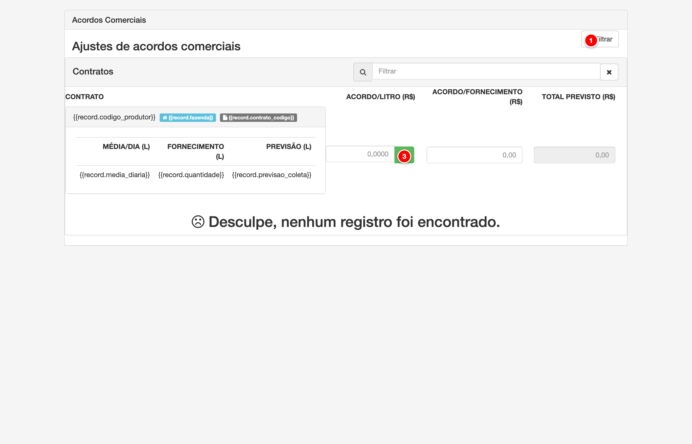

# Acordos comerciais

Os acordos comerciais permitem ajustar valores adicionais por litro ou por fornecimento total para contratos específicos. Esses valores são aplicados durante o cálculo da folha de pagamento, permitindo personalizar o pagamento de acordo com negociações individuais ou acordos diferenciados com produtores.

<figure>
  
  <figcaption>Tela de ajustes de acordos comerciais do módulo Pay</figcaption>
</figure>

> **Nota**: Tela de ajustes de acordos comerciais com os elementos principais numerados para referência.

## Descrição dos Elementos

Seguindo a numeração presente na imagem acima:

**1. Filtrar**

Botão que abre o painel de filtros para buscar contratos específicos.

**Como ajustar:**
- Acesse o menu Pagamento > Ajustes de Acordos Comerciais
- Clique no botão "Filtrar" no canto superior direito
- No painel de filtros que abre, configure:
  - **Código**: Código do contrato (opcional)
  - **Vigência início**: Data inicial do período de vigência (opcional)
  - **Vigência fim**: Data final do período de vigência (opcional)
- Clique em "Aplicar filtro" para buscar os contratos
- Clique em "Limpar filtro" para remover os filtros aplicados

**Para que serve:**
O filtro permite buscar contratos específicos para ajustar os valores de acordo comercial. É útil quando há muitos contratos cadastrados e você precisa localizar contratos específicos por código ou período de vigência.

**Como afeta o cálculo:**
O filtro não afeta diretamente os cálculos, mas permite localizar e ajustar os valores de acordo comercial dos contratos desejados. Os valores ajustados são aplicados durante o cálculo da folha de pagamento.

---

**2. Acordo por Litro (R$/L)**

Campo de entrada que permite definir o valor do acordo comercial por litro fornecido.

**Como ajustar:**
- Acesse o menu Pagamento > Ajustes de Acordos Comerciais
- Localize o contrato desejado na lista (use o filtro se necessário)
- No campo "ACORDO/LITRO (R$)" da linha do contrato, digite o valor do acordo por litro (exemplo: 0,2250)
- O sistema calcula automaticamente:
  - **Acordo/Fornecimento**: Valor total do acordo baseado no volume fornecido
  - **Total Previsto**: Valor previsto do acordo baseado na previsão de coleta
- Clique no botão de salvar (✓) para confirmar o ajuste

**Para que serve:**
O campo de acordo por litro permite definir um valor adicional que será aplicado a cada litro fornecido pelo produtor. Este valor é somado ao cálculo base do pagamento, permitindo personalizar o valor pago por contrato.

**Como afeta o cálculo:**
Durante o cálculo da folha de pagamento, o sistema multiplica o valor do acordo por litro pelo volume total fornecido pelo produtor no período. Este valor é então somado ao valor base do pagamento, resultando no valor final a ser pago. Por exemplo, se o acordo for R$ 0,2250 por litro e o produtor fornecer 1000 litros, será adicionado R$ 225,00 ao pagamento.

---

**3. Salvar Acordo**

Botão que salva o valor do acordo comercial ajustado para o contrato.

**Como ajustar:**
- Após ajustar o valor do acordo por litro no campo correspondente
- Clique no botão de salvar (ícone de check ✓) ao lado do campo
- O sistema salvará o valor e exibirá uma mensagem de confirmação

**Para que serve:**
O botão de salvar confirma e persiste o valor do acordo comercial ajustado no banco de dados. Sem salvar, as alterações não serão aplicadas aos cálculos da folha de pagamento.

**Como afeta o cálculo:**
Após salvar, o valor do acordo comercial é atualizado no contrato e será utilizado em todos os cálculos subsequentes da folha de pagamento. O valor salvo permanece ativo até que seja alterado novamente.

---

## Campos Adicionais

Além dos elementos numerados, a tela exibe informações e campos adicionais:

### Busca Rápida de Contratos

Campo de busca localizado no cabeçalho da tabela que permite filtrar contratos em tempo real pelo código.

**Como ajustar:**
- Digite o código do contrato no campo de busca
- A lista será filtrada automaticamente mostrando apenas os contratos que correspondem ao código digitado
- Clique no botão "X" para limpar o filtro

**Para que serve:**
A busca rápida permite localizar contratos específicos sem precisar usar o filtro completo, facilitando a navegação quando há muitos contratos na lista.

### Informações do Contrato

Cada linha da tabela exibe informações detalhadas do contrato:

- **Código do Produtor**: Identificação do produtor
- **Fazenda**: Nome da fazenda (quando aplicável)
- **Código do Contrato**: Código único do contrato
- **Média/Dia (L)**: Volume médio diário fornecido
- **Fornecimento (L)**: Volume total fornecido no período
- **Previsão (L)**: Volume previsto para coleta

### Acordo por Fornecimento (R$)

Campo que exibe o valor total do acordo baseado no volume fornecido. Este campo é calculado automaticamente quando você ajusta o acordo por litro.

**Como ajustar:**
- Você pode editar diretamente este campo para definir o valor total do acordo
- Ao alterar este valor, o sistema recalcula automaticamente o acordo por litro
- O valor é calculado como: Acordo por Litro × Volume Fornecido

**Para que serve:**
Permite definir o valor total do acordo diretamente, sem precisar calcular manualmente o valor por litro. Útil quando você conhece o valor total que deseja aplicar.

**Como afeta o cálculo:**
O valor definido neste campo é aplicado diretamente ao pagamento do produtor, independentemente do volume fornecido. É uma forma alternativa de definir o acordo comercial.

### Total Previsto (R$)

Campo somente leitura que exibe o valor previsto do acordo baseado na previsão de coleta.

**Para que serve:**
O campo de total previsto permite visualizar o valor estimado do acordo comercial caso a previsão de coleta seja atingida. É uma referência para planejamento e análise.

**Como afeta o cálculo:**
Este campo é apenas informativo e não afeta os cálculos da folha de pagamento. O valor real aplicado é baseado no volume efetivamente fornecido, não na previsão.

---

## Funcionamento dos Acordos Comerciais

Os acordos comerciais são valores adicionais que podem ser aplicados a contratos específicos, permitindo personalizar o pagamento além dos valores calculados pelas fórmulas de modelo de pagamento e indicadores SVL.

### Tipos de Ajuste

1. **Acordo por Litro**: Define um valor adicional por litro fornecido
   - Exemplo: R$ 0,2250 por litro
   - Cálculo: Volume Fornecido × Valor por Litro

2. **Acordo por Fornecimento**: Define um valor total fixo para o período
   - Exemplo: R$ 500,00 total
   - Cálculo: Valor fixo aplicado independentemente do volume

### Aplicação no Cálculo

Durante o cálculo da folha de pagamento:
1. O sistema calcula o valor base usando o modelo de pagamento configurado
2. Aplica os indicadores SVL (qualidade, produtividade, parceria, projetos)
3. Adiciona o valor do acordo comercial (por litro ou total)
4. Obtém o valor final a ser pago ao produtor

### Permissões

A edição dos valores de acordo comercial requer a permissão `f-ajusteacordo-edit`. Sem esta permissão, os campos estarão desabilitados e apenas será possível visualizar os valores configurados.
