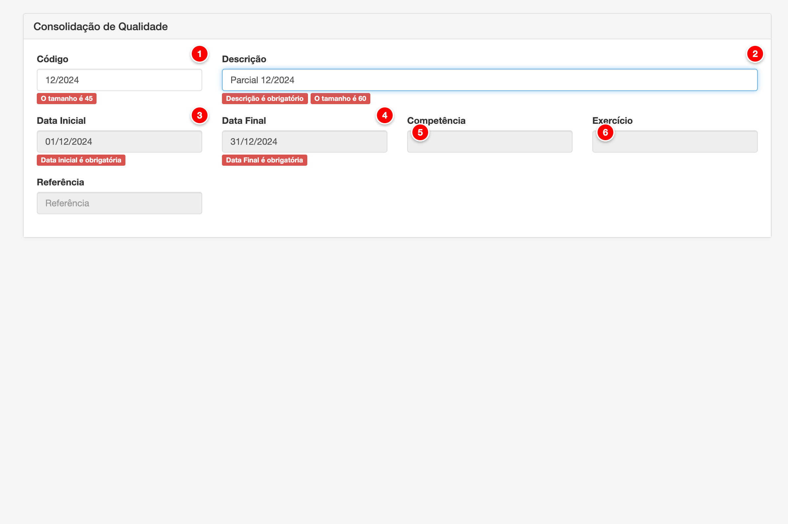

# Consolidação de qualidade

A consolidação de qualidade é o processo de agrupar e consolidar os indicadores de qualidade do leite (CCS, CPP, proteína, gordura, temperatura) de todos os produtores em um período específico. Cada consolidação representa um período de referência (competência e exercício) e contém os dados consolidados de qualidade que serão utilizados nos cálculos da folha de pagamento através do Sistema de Valorização do Leite (SVL).

<figure>
  
  <figcaption>Tela de consolidação de qualidade do módulo Pay</figcaption>
</figure>

> **Nota**: Tela de cadastro e edição de consolidações de qualidade com os campos principais numerados para referência.

## Descrição dos Elementos

Seguindo a numeração presente na imagem acima:

**1. Código**

Campo de texto que identifica unicamente a consolidação de qualidade dentro da conta.

**Como ajustar:**
- Acesse o menu Pagamento > Consolidação de Qualidade
- Clique em "Nova consolidação" ou edite uma consolidação existente
- No campo "Código", digite um código único (máximo 45 caracteres)
- O campo é opcional e pode ser deixado em branco
- O código não pode ser editado se a consolidação estiver fechada

**Para que serve:**
O código serve como identificador único da consolidação de qualidade, permitindo referenciar a consolidação em outros módulos do sistema. Facilita a organização e busca de consolidações quando há múltiplas consolidações cadastradas.

**Como afeta o cálculo:**
O código não afeta diretamente os cálculos da folha de pagamento, mas é essencial para identificar qual consolidação de qualidade está sendo utilizada. A consolidação selecionada determina quais indicadores de qualidade serão considerados nos cálculos do SVL para cada produtor.

---

**2. Descrição**

Campo de texto que define o nome ou descrição da consolidação de qualidade.

**Como ajustar:**
- No campo "Descrição", digite o nome descritivo da consolidação (máximo 60 caracteres)
- O campo é obrigatório e deve ser preenchido
- Exemplos: "Parcial 12/2024", "Consolidação Dezembro 2024", "Mensal 01/2025"
- A descrição não pode ser editada se a consolidação estiver fechada

**Para que serve:**
A descrição permite identificar facilmente o período e propósito da consolidação. Facilita a seleção da consolidação correta ao visualizar dados de qualidade e ajuda na organização das diferentes consolidações disponíveis.

**Como afeta o cálculo:**
A descrição não afeta os cálculos da folha de pagamento, mas é importante para identificar qual consolidação está sendo utilizada. Cada consolidação possui um período específico (competência e exercício) que determina quais dados de qualidade serão considerados.

---

**3. Data Inicial**

Campo de data que define o início do período de consolidação.

**Como ajustar:**
- No campo "Data Inicial", informe a data de início do período no formato DD/MM/AAAA
- O campo é obrigatório e só pode ser editado na criação da consolidação
- Após salvar, a data não pode ser alterada
- A data deve corresponder ao início do período de competência selecionado

**Para que serve:**
A data inicial define a partir de qual data os indicadores de qualidade serão considerados na consolidação. O sistema consolida todos os dados de qualidade (análises laboratoriais) dos produtores que estão dentro deste período.

**Como afeta o cálculo:**
A data inicial afeta diretamente os cálculos da folha de pagamento ao determinar quais análises laboratoriais serão incluídas na consolidação. O sistema considera apenas as análises realizadas entre a data inicial e a data final para calcular os indicadores consolidados de qualidade (médias de CCS, CPP, proteína, gordura, temperatura) que são utilizados no SVL.

---

**4. Data Final**

Campo de data que define o término do período de consolidação.

**Como ajustar:**
- No campo "Data Final", informe a data de término do período no formato DD/MM/AAAA
- O campo é obrigatório e só pode ser editado na criação da consolidação
- Após salvar, a data não pode ser alterada
- A data deve corresponder ao final do período de competência selecionado

**Para que serve:**
A data final define até quando os indicadores de qualidade serão considerados na consolidação. O sistema consolida todos os dados de qualidade dos produtores que estão dentro do período entre a data inicial e final.

**Como afeta o cálculo:**
A data final afeta diretamente os cálculos da folha de pagamento ao determinar quais análises laboratoriais serão incluídas na consolidação. O sistema considera apenas as análises realizadas entre a data inicial e a data final para calcular os indicadores consolidados de qualidade que são utilizados no SVL.

---

**5. Competência**

Campo de seleção que define o mês da consolidação.

**Como ajustar:**
- No campo "Competência", selecione o mês da consolidação (01 a 12)
- O campo é obrigatório e só pode ser editado na criação da consolidação
- Após salvar, a competência não pode ser alterada
- A competência é usada junto com o exercício para formar a referência (ex: "12/2024")

**Para que serve:**
A competência identifica o mês ao qual a consolidação se refere. É utilizada para organizar as consolidações por período mensal e formar a referência completa junto com o exercício (ano).

**Como afeta o cálculo:**
A competência não afeta diretamente os cálculos da folha de pagamento, mas é essencial para identificar e organizar as consolidações por período. A referência formada pela competência e exercício é utilizada para vincular a consolidação aos cálculos da folha de pagamento do período correspondente.

---

**6. Exercício**

Campo de seleção que define o ano da consolidação.

**Como ajustar:**
- No campo "Exercício", selecione o ano da consolidação
- O campo é obrigatório e só pode ser editado na criação da consolidação
- Após salvar, o exercício não pode ser alterado
- O exercício é usado junto com a competência para formar a referência (ex: "12/2024")

**Para que serve:**
O exercício identifica o ano ao qual a consolidação se refere. É utilizado para organizar as consolidações por período anual e formar a referência completa junto com a competência (mês).

**Como afeta o cálculo:**
O exercício não afeta diretamente os cálculos da folha de pagamento, mas é essencial para identificar e organizar as consolidações por período. A referência formada pela competência e exercício é utilizada para vincular a consolidação aos cálculos da folha de pagamento do período correspondente.

---

## Campos Adicionais

Alguns campos do formulário não aparecem numerados na imagem acima, mas são importantes para a configuração completa da consolidação:

**Referência**

Campo de texto calculado automaticamente que combina competência e exercício.

**Como ajustar:**
- O campo "Referência" é preenchido automaticamente quando você seleciona a competência e o exercício
- O formato é "MM/AAAA" (ex: "12/2024")
- O campo é somente leitura e não pode ser editado manualmente

**Para que serve:**
A referência fornece uma identificação visual rápida do período da consolidação, combinando mês e ano em um formato legível. Facilita a identificação da consolidação em listas e relatórios.

**Como afeta o cálculo:**
A referência não afeta os cálculos da folha de pagamento, sendo apenas uma representação visual da competência e exercício selecionados.

---

**Criar consolidação para produtores sem resultado no período**

Checkbox que aparece apenas na criação da consolidação.

**Como ajustar:**
- Este checkbox só aparece ao criar uma nova consolidação
- Marque o checkbox se deseja criar registros de consolidação para produtores que não possuem análises no período
- Deixe desmarcado para incluir apenas produtores com análises existentes

**Para que serve:**
Quando habilitado, o sistema cria registros de consolidação mesmo para produtores que não possuem análises laboratoriais no período. Isso permite manter um registro completo de todos os produtores, mesmo aqueles sem dados de qualidade no período.

**Como afeta o cálculo:**
Esta opção afeta os cálculos da folha de pagamento ao determinar quais produtores terão registros de consolidação criados. Produtores sem análises no período não terão indicadores de qualidade calculados, mas terão um registro de consolidação criado para referência.

---

**Fechado**

Status que indica se a consolidação está fechada e não pode mais ser editada.

**Como ajustar:**
- O status "Fechado" é controlado pelo sistema quando uma folha de pagamento é finalizada usando esta consolidação
- Quando fechada, a consolidação não pode mais ser editada
- Uma consolidação fechada pode ser reaberta através de funcionalidade específica do sistema (se permitido)

**Para que serve:**
O status fechado protege os dados da consolidação contra alterações acidentais após a folha de pagamento ter sido processada. Garante a integridade dos dados históricos e a rastreabilidade dos cálculos.

**Como afeta o cálculo:**
Uma consolidação fechada não pode ser editada, garantindo que os cálculos da folha de pagamento que já foram processados não sejam afetados por alterações posteriores. Isso mantém a consistência e rastreabilidade dos cálculos históricos.

---
