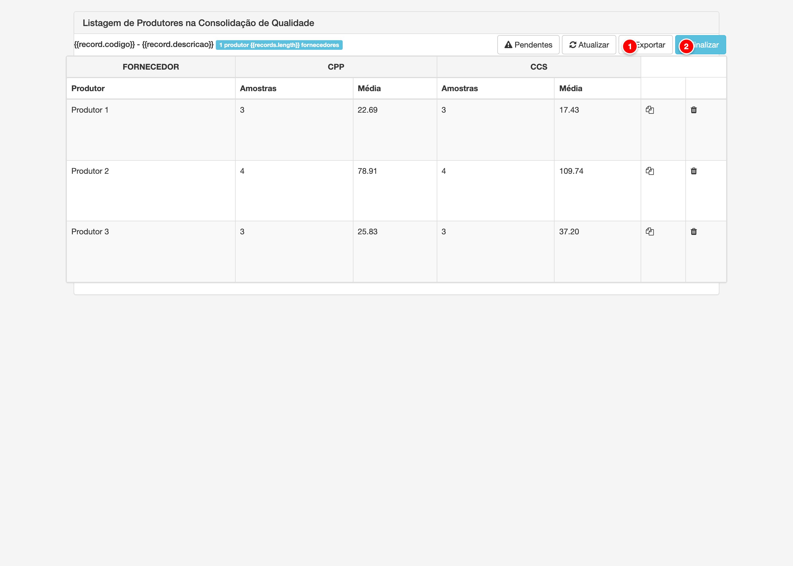

# Listagem de Produtores na Consolidação de Qualidade

A tela de listagem de produtores exibe todos os produtores incluídos em uma consolidação de qualidade específica, apresentando os indicadores de qualidade consolidados (médias de CPP, CCS, gordura, proteínas, ESD, sólidos, lactose, acidez, densidade, crioscopia e temperatura) calculados a partir das análises laboratoriais do período. Esta tela permite visualizar os dados consolidados, finalizar a consolidação, exportar os dados e gerenciar produtores pendentes.

<figure>
  
  <figcaption>Tela de listagem de produtores na consolidação de qualidade do módulo Pay</figcaption>
</figure>

> **Nota**: Tela de listagem de produtores com os botões de ação principais numerados para referência.

## Descrição dos Elementos

Seguindo a numeração presente na imagem acima:

**1. Finalizar**

Botão que fecha a consolidação de qualidade, impedindo alterações posteriores.

**Como usar:**
- Acesse a consolidação de qualidade desejada
- Verifique que há produtores incluídos na consolidação
- Clique no botão "Finalizar" (ícone de cadeado)
- Confirme a ação na mensagem de confirmação exibida
- Após finalizar, a consolidação não poderá mais ser editada

**Para que serve:**
O botão Finalizar protege os dados da consolidação contra alterações acidentais após a consolidação ter sido processada. Uma vez finalizada, a consolidação fica bloqueada para edição, garantindo a integridade dos dados históricos utilizados nos cálculos da folha de pagamento.

**Como afeta o cálculo:**
Uma consolidação finalizada não pode ser alterada, garantindo que os cálculos da folha de pagamento que já foram processados usando esta consolidação não sejam afetados por mudanças posteriores. Isso mantém a consistência e rastreabilidade dos cálculos históricos. A consolidação finalizada é utilizada como referência fixa para os indicadores de qualidade no período.

---

**2. Atualizar**

Botão que recarrega os dados do grid, atualizando os indicadores consolidados.

**Como usar:**
- Clique no botão "Atualizar" (ícone de refresh)
- O sistema recarrega os dados do grid com os indicadores mais recentes
- Aguarde o carregamento dos dados atualizados
- O botão só está disponível quando a consolidação não está finalizada

**Para que serve:**
O botão Atualizar permite recarregar os dados da consolidação quando há novas análises laboratoriais ou quando os dados foram modificados. Isso garante que você está visualizando os indicadores consolidados mais atualizados antes de finalizar a consolidação.

**Como afeta o cálculo:**
Ao atualizar, o sistema recalcula os indicadores consolidados (médias) de cada produtor com base nas análises laboratoriais disponíveis no período. Esses indicadores atualizados serão utilizados nos cálculos do SVL quando a consolidação for finalizada e utilizada na folha de pagamento.

---

## Outros Botões de Ação

Alguns botões aparecem condicionalmente ou em situações específicas:

**Exportar**

Botão que exporta os dados da consolidação para um arquivo CSV.

**Como usar:**
- O botão "Exportar" (ícone de Excel) só aparece quando a consolidação está finalizada
- Clique no botão para gerar o arquivo CSV
- O arquivo será baixado automaticamente com todos os dados da consolidação
- O arquivo contém os indicadores consolidados de todos os produtores

**Para que serve:**
A exportação permite criar relatórios externos, análises em planilhas ou backup dos dados consolidados. O arquivo CSV pode ser aberto em Excel ou outras ferramentas de análise de dados.

**Como afeta o cálculo:**
A exportação não afeta os cálculos da folha de pagamento, sendo apenas uma funcionalidade de relatório e backup dos dados já consolidados.

---

**Pendentes**

Botão que exibe uma lista de produtores que possuem coletas no período mas não foram incluídos na consolidação.

**Como usar:**
- O botão "Pendentes" (ícone de aviso) só aparece quando há produtores pendentes
- Clique no botão para abrir uma modal com a lista de produtores pendentes
- A modal mostra o nome, código e volume de cada produtor pendente
- Feche a modal após verificar as informações

**Para que serve:**
O botão Pendentes ajuda a identificar produtores que deveriam estar na consolidação mas não foram incluídos, geralmente por falta de análises laboratoriais no período ou por configurações específicas. Permite verificar se há produtores que precisam ser incluídos manualmente ou se há problemas com as análises.

**Como afeta o cálculo:**
Produtores pendentes não terão indicadores de qualidade consolidados, o que pode afetar os cálculos do SVL se esses produtores forem incluídos na folha de pagamento. É importante verificar os pendentes antes de finalizar a consolidação para garantir que todos os produtores necessários estejam incluídos.

---

## Grid de Indicadores de Qualidade

O grid exibe os indicadores de qualidade consolidados para cada produtor incluído na consolidação. Cada indicador mostra duas informações:

- **Nº Amostras**: Quantidade de análises laboratoriais utilizadas para calcular a média
- **Média**: Valor médio do indicador no período da consolidação

### Indicadores Exibidos

**CPP (Contagem de Plaquetas)**
- Média do número de plaquetas por mililitro de leite
- Utilizado no cálculo do SVL para valorização da qualidade

**CCS (Contagem de Células Somáticas)**
- Média do número de células somáticas por mililitro de leite
- Indicador de qualidade sanitária do leite
- Utilizado no cálculo do SVL

**Gordura**
- Média do teor de gordura do leite (em porcentagem)
- Utilizado no cálculo do SVL e na valorização do leite

**Proteínas**
- Média do teor de proteínas do leite (em porcentagem)
- Utilizado no cálculo do SVL

**ESD (Extrato Seco Desengordurado)**
- Média do extrato seco desengordurado do leite
- Utilizado no cálculo do SVL

**Sólidos**
- Média do teor de sólidos totais do leite
- Utilizado no cálculo do SVL

**Lactose**
- Média do teor de lactose do leite (em porcentagem)
- Utilizado no cálculo do SVL

**Acidez**
- Média da acidez do leite
- Indicador de qualidade e conservação

**Densidade**
- Média da densidade do leite
- Indicador de qualidade

**Crioscopia**
- Média do ponto de congelamento do leite
- Indicador de adulteração ou adição de água

**Temperatura**
- Média da temperatura do leite na coleta
- Indicador de qualidade e conservação
- Utilizado no cálculo do SVL

### Como os Dados São Consolidados

Os indicadores são calculados como médias aritméticas de todas as análises laboratoriais do produtor realizadas no período entre a data inicial e data final da consolidação. O número de amostras indica quantas análises foram utilizadas para calcular cada média.

### Impacto nos Cálculos

Os indicadores consolidados são utilizados pelo Sistema de Valorização do Leite (SVL) nos cálculos da folha de pagamento. Cada indicador pode ter um impacto positivo ou negativo no valor final a ser pago ao produtor, dependendo das configurações do modelo de pagamento e dos parâmetros do SVL.

---

