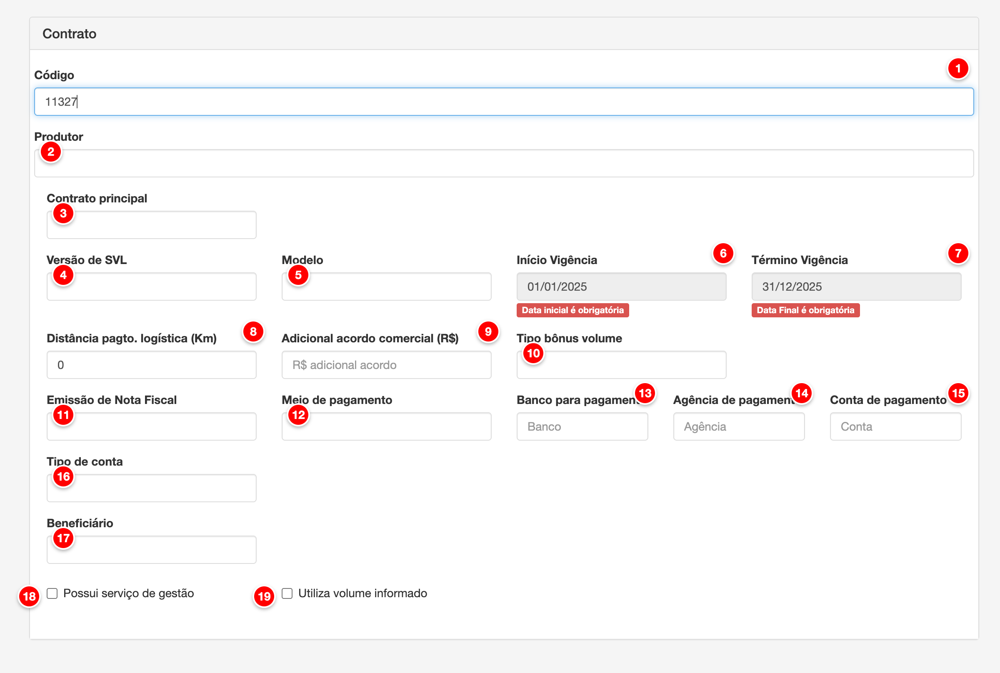

# Contratos e vigências

Os contratos definem as configurações individuais de cada produtor para o cálculo da folha de pagamento. Cada contrato vincula um produtor a um modelo de pagamento, define períodos de vigência, configura acordos comerciais, bônus, formas de pagamento e outras configurações específicas que afetam como o pagamento será calculado e processado.

<figure>
  
  <figcaption>Tela de contratos e vigências do módulo Pay</figcaption>
</figure>

> **Nota**: Tela de cadastro e edição de contratos com os campos principais numerados para referência.

## Descrição dos Elementos

Seguindo a numeração presente na imagem acima:

**1. Código**

Campo de texto que identifica unicamente o contrato dentro da conta.

**Como ajustar:**
- Acesse o menu Pagamento > Contratos e Vigências
- Clique em "Novo contrato" ou edite um contrato existente
- No campo "Código", digite um código único (máximo 45 caracteres)
- O código é obrigatório e não pode ser duplicado na mesma conta

**Para que serve:**
O código serve como identificador único do contrato, permitindo referenciar o contrato em outros módulos do sistema. Facilita a organização e busca de contratos quando há múltiplos contratos cadastrados para diferentes produtores.

**Como afeta o cálculo:**
O código não afeta diretamente os cálculos da folha de pagamento, mas é essencial para identificar qual contrato está sendo utilizado. O contrato selecionado determina todas as configurações que serão aplicadas no cálculo do pagamento do produtor.

---

**2. Produtor**

Campo de seleção que identifica o produtor vinculado ao contrato.

**Como ajustar:**
- Acesse o menu Pagamento > Contratos e Vigências
- Clique em "Novo contrato" ou edite um contrato existente
- No campo "Produtor", selecione o produtor da lista
- O campo é obrigatório e deve ser preenchido antes de salvar

**Para que serve:**
O produtor identifica a quem o contrato pertence e para quem o pagamento será calculado. Cada contrato está vinculado a um único produtor, permitindo que diferentes produtores tenham configurações específicas de pagamento.

**Como afeta o cálculo:**
O produtor selecionado determina de quem serão considerados os volumes, análises laboratoriais e demais dados utilizados no cálculo da folha de pagamento. Todos os cálculos são feitos com base nos dados deste produtor específico.

---

**3. Contrato principal**

Campo de seleção opcional que permite vincular este contrato a um contrato principal.

**Como ajustar:**
- No campo "Contrato principal", selecione um contrato existente da lista (opcional)
- Este campo só aparece se houver outros contratos cadastrados
- Deixe em branco se este for um contrato independente

**Para que serve:**
O contrato principal permite criar contratos secundários ou subcontratos vinculados a um contrato principal. Útil para casos onde um produtor possui múltiplos contratos relacionados, como contratos de diferentes fazendas vinculados a um contrato principal.

**Como afeta o cálculo:**
A vinculação com contrato principal não afeta diretamente os cálculos da folha de pagamento, mas pode ser utilizada para organização e referência entre contratos relacionados. Cada contrato mantém suas próprias configurações de cálculo independentemente da vinculação.

---

**4. Versão de SVL**

Campo de seleção que define qual versão do Sistema de Valorização do Leite (SVL) será utilizada no contrato.

**Como ajustar:**
- No campo "Versão de SVL", selecione uma versão da lista
- O campo é obrigatório e deve ser preenchido
- As versões disponíveis são as cadastradas no sistema SVL

**Para que serve:**
A versão de SVL define quais regras e critérios de valorização serão aplicados no cálculo do pagamento. Diferentes versões podem ter diferentes tabelas de bônus, descontos e critérios de qualidade, permitindo evoluir o sistema de valorização ao longo do tempo.

**Como afeta o cálculo:**
A versão de SVL afeta diretamente os cálculos da folha de pagamento ao determinar como os indicadores de qualidade (CCS, CPP, proteína, gordura, etc.) serão valorizados. Cada versão possui suas próprias regras de cálculo, impactando os valores de bônus e descontos aplicados ao produtor.

---

**5. Modelo**

Campo de seleção que define qual modelo de pagamento será utilizado no contrato.

**Como ajustar:**
- No campo "Modelo", selecione um modelo de pagamento da lista
- O campo é obrigatório e deve ser preenchido
- Os modelos disponíveis são os cadastrados em Modelos de Pagamento e que estão ativos

**Para que serve:**
O modelo de pagamento define a fórmula de cálculo que será utilizada para calcular o pagamento do produtor. Cada modelo possui uma fórmula única que combina preços, volumes, indicadores SVL e operadores matemáticos.

**Como afeta o cálculo:**
O modelo selecionado é o componente central que determina como o pagamento será calculado. A fórmula do modelo define quais elementos serão considerados (preços, volumes, SVL) e como eles serão combinados para obter o valor final do pagamento. Esta é uma das configurações mais importantes do contrato.

---

**6. Início Vigência**

Campo de data que define quando o contrato começa a ter validade.

**Como ajustar:**
- No campo "Início Vigência", informe a data de início do contrato no formato DD/MM/AAAA
- O campo é obrigatório e só pode ser editado na criação do contrato
- Após salvar, a data não pode ser alterada

**Para que serve:**
A data de início da vigência define a partir de qual data o contrato passa a ser válido e pode ser utilizado nos cálculos da folha de pagamento. Contratos só são considerados ativos a partir desta data.

**Como afeta o cálculo:**
A data de início da vigência afeta os cálculos da folha de pagamento ao determinar se o contrato deve ser considerado em um determinado período. O sistema só utiliza contratos que estão vigentes (entre a data de início e término) para calcular o pagamento do produtor em cada folha.

---

**7. Término Vigência**

Campo de data que define quando o contrato deixa de ter validade.

**Como ajustar:**
- No campo "Término Vigência", informe a data de término do contrato no formato DD/MM/AAAA
- O campo é obrigatório e só pode ser editado na criação do contrato
- Após salvar, a data não pode ser alterada

**Para que serve:**
A data de término da vigência define até quando o contrato permanece válido e pode ser utilizado nos cálculos da folha de pagamento. Após esta data, o contrato não é mais considerado ativo.

**Como afeta o cálculo:**
A data de término da vigência afeta os cálculos da folha de pagamento ao determinar se o contrato deve ser considerado em um determinado período. O sistema só utiliza contratos que estão vigentes (entre a data de início e término) para calcular o pagamento do produtor. Após a data de término, é necessário criar uma nova vigência ou um novo contrato.

---

**8. Distância pagto. logística (Km)**

Campo numérico que define a distância em quilômetros para cálculo de pagamento de logística.

**Como ajustar:**
- No campo "Distância pagto. logística (Km)", informe a distância em quilômetros (valor entre 0 e 99999)
- O campo é opcional e pode ser deixado em branco
- O valor é utilizado para cálculos de bônus ou descontos relacionados à logística

**Para que serve:**
A distância de pagamento de logística permite configurar um valor específico de distância que será utilizado nos cálculos relacionados à logística de coleta. Este valor pode ser usado em fórmulas de pagamento que consideram a distância percorrida.

**Como afeta o cálculo:**
A distância afeta os cálculos da folha de pagamento quando o modelo de pagamento ou configurações SVL utilizam este valor para calcular bônus ou descontos relacionados à logística. O valor informado substitui a distância real calculada pelo sistema, permitindo ajustes manuais quando necessário.

---

**9. Adicional acordo comercial (R$)**

Campo numérico que define um valor adicional de acordo comercial em reais.

**Como ajustar:**
- No campo "Adicional acordo comercial (R$)", informe o valor adicional em reais (valor entre 0 e 99999)
- O campo é opcional e pode ser deixado em branco
- O valor pode ter até 4 casas decimais

**Para que serve:**
O adicional de acordo comercial permite configurar um valor fixo adicional que será incluído no cálculo do pagamento. Este valor representa acordos comerciais específicos negociados com o produtor, como bônus fixos ou valores adicionais por litro.

**Como afeta o cálculo:**
O adicional de acordo comercial afeta diretamente os cálculos da folha de pagamento ao adicionar o valor informado ao montante do pagamento. Este valor é somado aos demais componentes do cálculo (preço, volumes, SVL) conforme a fórmula do modelo de pagamento configurado.

---

**10. Tipo bônus volume**

Campo de seleção que define como o bônus de volume será calculado.

**Como ajustar:**
- No campo "Tipo bônus volume", selecione uma das opções:
  - **Individual (I)**: Bônus calculado apenas com o volume do produtor
  - **Tanque (T)**: Bônus calculado com o volume agregado de um tanque coletivo
  - **Cooperativa (C)**: Bônus calculado com o volume agregado de uma cooperativa
- O campo é opcional e o padrão é "Individual"

**Para que serve:**
O tipo de bônus de volume define se o bônus será calculado apenas com o volume individual do produtor ou se será agregado com volumes de outros produtores (tanque coletivo ou cooperativa). Permite criar incentivos para produção coletiva ou individual.

**Como afeta o cálculo:**
O tipo de bônus de volume afeta os cálculos da folha de pagamento ao determinar qual volume será utilizado para calcular o bônus. Quando selecionado "Tanque" ou "Cooperativa", o sistema agrega os volumes de todos os produtores vinculados ao mesmo tanque ou cooperativa, resultando em valores de bônus maiores para todos os participantes.

---

**11. Tanque coletivo agregado**

Campo de seleção que aparece quando o tipo de bônus volume é "Tanque".

**Como ajustar:**
- Este campo só aparece quando "Tipo bônus volume" está configurado como "Tanque (T)"
- Selecione o tanque coletivo da lista
- O campo é obrigatório quando o tipo é "Tanque"

**Para que serve:**
O tanque coletivo agregado identifica qual tanque será utilizado para agregar os volumes de múltiplos produtores no cálculo do bônus de volume. Todos os produtores vinculados ao mesmo tanque terão seus volumes somados para o cálculo do bônus.

**Como afeta o cálculo:**
O tanque selecionado afeta os cálculos da folha de pagamento ao determinar quais produtores terão seus volumes agregados. O sistema soma os volumes de todos os produtores vinculados ao mesmo tanque e utiliza este volume total para calcular o bônus, que é então distribuído proporcionalmente entre os participantes.

---

**12. Cooperativa agregada**

Campo de seleção que aparece quando o tipo de bônus volume é "Cooperativa".

**Como ajustar:**
- Este campo só aparece quando "Tipo bônus volume" está configurado como "Cooperativa (C)"
- Selecione a cooperativa da lista
- O campo é obrigatório quando o tipo é "Cooperativa"

**Para que serve:**
A cooperativa agregada identifica qual cooperativa será utilizada para agregar os volumes de múltiplos produtores no cálculo do bônus de volume. Todos os produtores vinculados à mesma cooperativa terão seus volumes somados para o cálculo do bônus.

**Como afeta o cálculo:**
A cooperativa selecionada afeta os cálculos da folha de pagamento ao determinar quais produtores terão seus volumes agregados. O sistema soma os volumes de todos os produtores vinculados à mesma cooperativa e utiliza este volume total para calcular o bônus, que é então distribuído proporcionalmente entre os participantes.

---

**13. Substituir produção por bônus de volume**

Checkbox que aparece quando o tipo de bônus volume é "Tanque" ou "Cooperativa".

**Como ajustar:**
- Este checkbox só aparece quando "Tipo bônus volume" está configurado como "Tanque (T)" ou "Cooperativa (C)"
- Marque o checkbox se deseja que o volume de produção seja substituído pelo bônus de volume no cálculo
- Deixe desmarcado para manter o volume de produção original

**Para que serve:**
Quando habilitado, o volume de produção individual do produtor é substituído pelo volume agregado (tanque ou cooperativa) no cálculo do pagamento. Isso permite que o produtor receba o pagamento baseado no volume total do grupo, não apenas no seu volume individual.

**Como afeta o cálculo:**
Esta opção afeta significativamente os cálculos da folha de pagamento. Quando habilitada, o sistema substitui o volume individual do produtor pelo volume agregado (tanque ou cooperativa) em todos os cálculos da fórmula de pagamento. Isso resulta em valores de pagamento maiores, pois o volume utilizado é o total do grupo, não apenas o individual.

---

**14. Emissão de Nota Fiscal**

Campo de seleção que define como a nota fiscal eletrônica será emitida para este contrato.

**Como ajustar:**
- No campo "Emissão de Nota Fiscal", selecione uma das opções disponíveis
- O campo é obrigatório e deve ser preenchido
- As opções disponíveis são configuradas no sistema

**Para que serve:**
A emissão de nota fiscal define o tipo de emissão que será utilizado ao gerar notas fiscais eletrônicas para os pagamentos deste contrato. Controla aspectos fiscais e legais da emissão das notas.

**Como afeta o cálculo:**
A emissão de nota fiscal não afeta diretamente os cálculos da folha de pagamento, mas é essencial para a emissão correta das notas fiscais. O tipo selecionado determina como os valores serão classificados e apresentados na nota fiscal eletrônica.

---

**15. Meio de pagamento**

Campo de seleção que define a forma de pagamento utilizada para este contrato.

**Como ajustar:**
- No campo "Meio de pagamento", selecione uma das opções disponíveis
- O campo é obrigatório e deve ser preenchido
- As opções disponíveis são configuradas no sistema (ex: Transferência, TED, DOC, etc.)

**Para que serve:**
O meio de pagamento define como o valor do pagamento será transferido para o produtor. Esta informação é utilizada para processar os pagamentos e gerar os arquivos de remessa bancária.

**Como afeta o cálculo:**
O meio de pagamento não afeta os cálculos da folha de pagamento, mas é essencial para o processamento dos pagamentos. O valor calculado permanece o mesmo, independentemente do meio de pagamento selecionado.

---

**16. Banco para pagamento**

Campo de texto que identifica o banco onde o pagamento será realizado.

**Como ajustar:**
- No campo "Banco para pagamento", digite o nome ou código do banco (máximo 60 caracteres)
- O campo é opcional e pode ser deixado em branco
- Esta informação é utilizada para identificação nos arquivos de remessa bancária

**Para que serve:**
O banco para pagamento identifica a instituição financeira onde o produtor possui conta e onde o pagamento será depositado. Facilita a organização e processamento dos pagamentos.

**Como afeta o cálculo:**
O banco não afeta os cálculos da folha de pagamento, sendo apenas uma informação para processamento e identificação do pagamento.

---

**17. Agência de pagamento**

Campo de texto que identifica a agência bancária onde o pagamento será realizado.

**Como ajustar:**
- No campo "Agência de pagamento", digite o número da agência (máximo 20 caracteres)
- O campo é opcional e pode ser deixado em branco
- Esta informação é utilizada nos arquivos de remessa bancária

**Para que serve:**
A agência de pagamento identifica a agência bancária específica onde o produtor possui conta. É necessária para processar corretamente os pagamentos via transferência bancária.

**Como afeta o cálculo:**
A agência não afeta os cálculos da folha de pagamento, sendo apenas uma informação para processamento do pagamento.

---

**18. Conta de pagamento**

Campo de texto que identifica o número da conta bancária onde o pagamento será depositado.

**Como ajustar:**
- No campo "Conta de pagamento", digite o número da conta (máximo 20 caracteres)
- O campo é opcional e pode ser deixado em branco
- Esta informação é utilizada nos arquivos de remessa bancária

**Para que serve:**
A conta de pagamento identifica o número da conta bancária do produtor onde o valor será depositado. É essencial para processar corretamente os pagamentos via transferência bancária.

**Como afeta o cálculo:**
A conta não afeta os cálculos da folha de pagamento, sendo apenas uma informação para processamento do pagamento.

---

**19. Tipo de conta**

Campo de seleção que define o tipo da conta bancária (corrente ou poupança).

**Como ajustar:**
- No campo "Tipo de conta", selecione o tipo da conta:
  - **Corrente (C)**: Conta corrente
  - **Poupança (P)**: Conta poupança
- O campo é obrigatório e deve ser preenchido

**Para que serve:**
O tipo de conta identifica se a conta bancária é corrente ou poupança. Esta informação é necessária para processar corretamente os pagamentos via transferência bancária, pois diferentes tipos de conta podem ter diferentes procedimentos.

**Como afeta o cálculo:**
O tipo de conta não afeta os cálculos da folha de pagamento, mas é essencial para o processamento correto dos pagamentos bancários.

---

**20. Beneficiário**

Campo de seleção que define quem será o beneficiário do pagamento.

**Como ajustar:**
- No campo "Beneficiário", selecione uma das opções:
  - **Produtor (P)**: O próprio produtor será o beneficiário
  - **Terceiro (T)**: Um terceiro será o beneficiário (requer nome e CPF)
- O campo é obrigatório e o padrão é "Produtor"

**Para que serve:**
O beneficiário define quem receberá o pagamento. Permite que o pagamento seja feito diretamente ao produtor ou a um terceiro (como um representante ou empresa).

**Como afeta o cálculo:**
O beneficiário não afeta os cálculos da folha de pagamento, mas determina para quem o valor calculado será pago. O valor permanece o mesmo, independentemente de quem seja o beneficiário.

---

**21. Nome do beneficiário**

Campo de texto que aparece quando o beneficiário é "Terceiro".

**Como ajustar:**
- Este campo só aparece quando "Beneficiário" está configurado como "Terceiro (T)"
- No campo "Nome do beneficiário", digite o nome completo do beneficiário (máximo 255 caracteres)
- O campo é obrigatório quando o beneficiário é terceiro

**Para que serve:**
O nome do beneficiário identifica a pessoa ou empresa que receberá o pagamento quando o beneficiário for um terceiro. Esta informação é utilizada nos documentos de pagamento e notas fiscais.

**Como afeta o cálculo:**
O nome do beneficiário não afeta os cálculos da folha de pagamento, sendo apenas uma informação para identificação do recebedor do pagamento.

---

**22. CPF**

Campo de texto que aparece quando o beneficiário é "Terceiro".

**Como ajustar:**
- Este campo só aparece quando "Beneficiário" está configurado como "Terceiro (T)"
- No campo "CPF", digite o CPF do beneficiário no formato XXX.XXX.XXX-XX
- O campo é obrigatório quando o beneficiário é terceiro e deve ser um CPF válido

**Para que serve:**
O CPF do beneficiário identifica o documento fiscal do terceiro que receberá o pagamento. Esta informação é necessária para emissão de notas fiscais e documentos fiscais quando o beneficiário não é o produtor.

**Como afeta o cálculo:**
O CPF não afeta os cálculos da folha de pagamento, sendo apenas uma informação fiscal necessária para documentação e emissão de notas fiscais.

---

**23. Possui serviço de gestão**

Checkbox que indica se o produtor possui serviço de gestão contratado.

**Como ajustar:**
- Marque o checkbox "Possui serviço de gestão" se o produtor possui serviço de gestão contratado
- Deixe desmarcado se o produtor não possui serviço de gestão
- Quando marcado, aparecem campos adicionais para configuração do bônus de gestão

**Para que serve:**
O serviço de gestão identifica se o produtor possui um serviço de gestão contratado que pode gerar bônus adicionais no pagamento. Quando habilitado, permite configurar como o bônus de gestão será calculado.

**Como afeta o cálculo:**
Quando habilitado, o serviço de gestão pode afetar os cálculos da folha de pagamento através do bônus de gestão configurado. O bônus de gestão é calculado e adicionado ao pagamento conforme as configurações do tipo de bônus de gestão selecionado.

---

**24. Tipo bônus gestão**

Campo de seleção que aparece quando "Possui serviço de gestão" está marcado.

**Como ajustar:**
- Este campo só aparece quando "Possui serviço de gestão" está marcado
- No campo "Tipo bônus gestão", selecione uma das opções:
  - **Individual (I)**: Bônus calculado apenas com o volume do produtor
  - **Tanque (T)**: Bônus calculado com o volume agregado de um tanque coletivo
  - **Cooperativa (C)**: Bônus calculado com o volume agregado de uma cooperativa
- O campo é opcional e o padrão é "Individual"

**Para que serve:**
O tipo de bônus de gestão define se o bônus será calculado apenas com o volume individual do produtor ou se será agregado com volumes de outros produtores (tanque coletivo ou cooperativa). Permite criar incentivos para gestão coletiva ou individual.

**Como afeta o cálculo:**
O tipo de bônus de gestão afeta os cálculos da folha de pagamento ao determinar qual volume será utilizado para calcular o bônus de gestão. Quando selecionado "Tanque" ou "Cooperativa", o sistema agrega os volumes de todos os produtores vinculados, resultando em valores de bônus maiores.

---

**25. Tanque coletivo agregado gestão**

Campo de seleção que aparece quando o tipo de bônus gestão é "Tanque".

**Como ajustar:**
- Este campo só aparece quando "Tipo bônus gestão" está configurado como "Tanque (T)"
- Selecione o tanque coletivo da lista
- O campo é obrigatório quando o tipo é "Tanque"

**Para que serve:**
O tanque coletivo agregado gestão identifica qual tanque será utilizado para agregar os volumes de múltiplos produtores no cálculo do bônus de gestão. Todos os produtores vinculados ao mesmo tanque terão seus volumes somados para o cálculo do bônus.

**Como afeta o cálculo:**
O tanque selecionado afeta os cálculos da folha de pagamento ao determinar quais produtores terão seus volumes agregados para o cálculo do bônus de gestão. O sistema soma os volumes de todos os produtores vinculados ao mesmo tanque e utiliza este volume total para calcular o bônus.

---

**26. Cooperativa agregada gestão**

Campo de seleção que aparece quando o tipo de bônus gestão é "Cooperativa".

**Como ajustar:**
- Este campo só aparece quando "Tipo bônus gestão" está configurado como "Cooperativa (C)"
- Selecione a cooperativa da lista
- O campo é obrigatório quando o tipo é "Cooperativa"

**Para que serve:**
A cooperativa agregada gestão identifica qual cooperativa será utilizada para agregar os volumes de múltiplos produtores no cálculo do bônus de gestão. Todos os produtores vinculados à mesma cooperativa terão seus volumes somados para o cálculo do bônus.

**Como afeta o cálculo:**
A cooperativa selecionada afeta os cálculos da folha de pagamento ao determinar quais produtores terão seus volumes agregados para o cálculo do bônus de gestão. O sistema soma os volumes de todos os produtores vinculados à mesma cooperativa e utiliza este volume total para calcular o bônus.

---

**27. Utiliza volume informado**

Checkbox que define se o sistema deve utilizar o volume informado ao invés do volume coletado.

**Como ajustar:**
- Marque o checkbox "Utiliza volume informado" se deseja que o sistema use o volume informado pelo produtor
- Deixe desmarcado para usar o volume coletado automaticamente pelo sistema
- O campo é opcional

**Para que serve:**
A opção de utilizar volume informado permite que o produtor informe manualmente o volume de leite fornecido, ao invés de usar o volume coletado automaticamente pelo sistema. Útil para casos onde há necessidade de ajustes manuais ou quando o volume coletado não reflete o volume real.

**Como afeta o cálculo:**
Esta opção afeta diretamente os cálculos da folha de pagamento ao determinar qual volume será utilizado. Quando habilitada, o sistema utiliza o volume informado pelo produtor ao invés do volume coletado. Isso pode resultar em diferenças significativas no cálculo do pagamento, pois o volume é um componente fundamental da fórmula de pagamento.

---

## Campos Condicionais

Alguns campos do formulário aparecem apenas quando determinadas condições são atendidas. Estes campos não aparecem numerados na imagem acima, mas são importantes para a configuração completa do contrato:

**Fazenda**

Campo de seleção que aparece quando a configuração "Pagamento por fazenda" está habilitada.

**Como ajustar:**
- Este campo só aparece quando a configuração do sistema permite pagamento por fazenda
- No campo "Fazenda", selecione a fazenda do produtor (opcional)
- O campo permite vincular o contrato a uma fazenda específica

**Para que serve:**
A fazenda permite vincular o contrato a uma propriedade específica do produtor. Útil quando um produtor possui múltiplas fazendas e cada uma precisa de configurações de pagamento diferentes.

**Como afeta o cálculo:**
A fazenda pode afetar os cálculos da folha de pagamento quando há configurações específicas por fazenda ou quando os volumes e análises são separados por fazenda. O sistema pode considerar apenas os dados da fazenda selecionada nos cálculos.

---

**Tanque coletivo agregado / Cooperativa agregada (Bônus Volume)**

Estes campos aparecem quando "Tipo bônus volume" está configurado como "Tanque" ou "Cooperativa" (documentados nos itens 11 e 12 acima).

---

**Substituir produção por bônus de volume**

Este checkbox aparece quando "Tipo bônus volume" está configurado como "Tanque" ou "Cooperativa" (documentado no item 13 acima).

---

**Nome do beneficiário / CPF**

Estes campos aparecem quando "Beneficiário" está configurado como "Terceiro" (documentados nos itens 21 e 22 acima).

---

**Tipo bônus gestão / Tanque coletivo agregado gestão / Cooperativa agregada gestão**

Estes campos aparecem quando "Possui serviço de gestão" está marcado (documentados nos itens 24, 25 e 26 acima).

---
