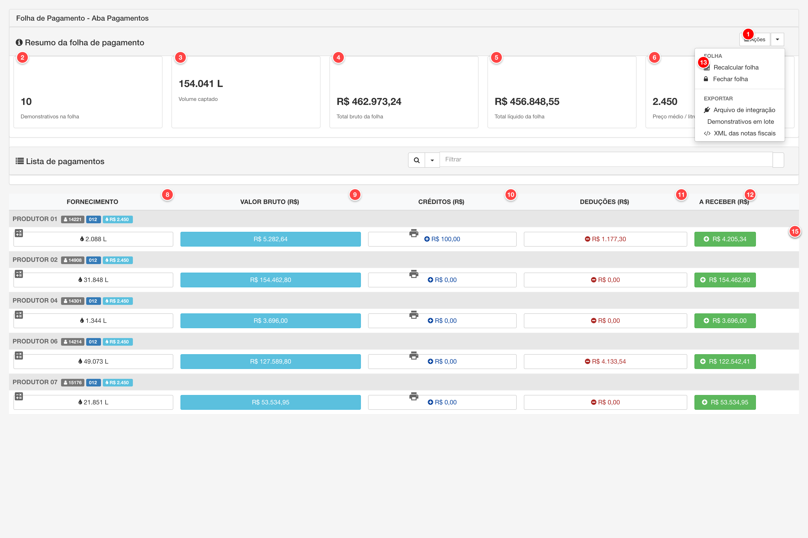
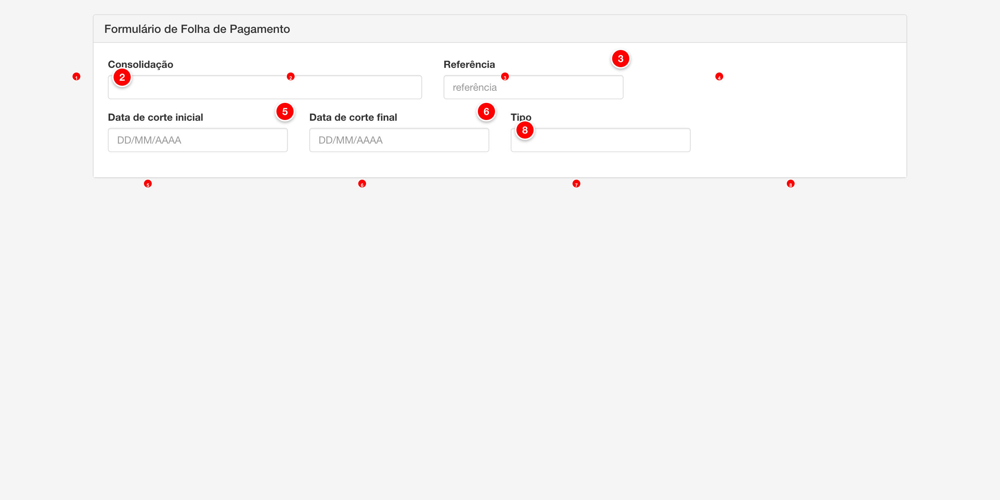

# Folha e simulações

As folhas de pagamento são documentos que consolidam os cálculos de pagamento aos produtores de leite em um período específico. Cada folha está vinculada a uma consolidação de qualidade e contém os demonstrativos de pagamento de todos os produtores que forneceram leite no período. O sistema também permite criar simulações de folhas para projeção de valores antes do fechamento definitivo.

## Listagem de Folhas de Pagamento

A tela de listagem exibe todas as folhas de pagamento cadastradas no sistema, permitindo visualizar informações resumidas, status e realizar ações sobre cada folha.

<figure>
  
  <figcaption>Tela de listagem de folhas de pagamento do módulo Pay</figcaption>
</figure>

> **Nota**: Tela de listagem de folhas de pagamento com os elementos principais numerados para referência.

## Descrição dos Elementos da Listagem

Seguindo a numeração presente na imagem acima:

**1. Nova folha**

Botão dropdown que permite criar uma nova folha de pagamento ou simulação.

**Como ajustar:**
- Acesse o menu Pagamento > Folha de Pagamento
- Clique no botão "Nova folha" no canto superior direito
- O formulário de criação será aberto
- Preencha os campos obrigatórios (Consolidação, Referência, Datas) e clique em "Salvar"

**Para que serve:**
Permite criar novas folhas de pagamento no sistema. Cada folha está vinculada a uma consolidação de qualidade e representa um período específico de fornecimento de leite.

**Como afeta o cálculo:**
As novas folhas criadas ficam disponíveis para cálculo de pagamentos. Após criar a folha, é necessário calcular os pagamentos dos produtores, o que gera os demonstrativos individuais baseados nos modelos de pagamento configurados.

---

**2. Simulação**

Opção no dropdown "Nova folha" que permite criar uma simulação de folha de pagamento.

**Como ajustar:**
- Acesse o menu Pagamento > Folha de Pagamento
- Clique no botão "Nova folha" e selecione "Simulação" no dropdown
- O formulário de simulação será aberto
- Preencha os campos e clique em "Salvar"
- A simulação será criada com status "Simulação" e pode ser calculada para projeção de valores

**Para que serve:**
Permite criar simulações de folhas de pagamento para projeção de valores antes do fechamento definitivo. As simulações não afetam os registros oficiais e podem ser utilizadas para análise e planejamento.

**Como afeta o cálculo:**
As simulações utilizam os mesmos modelos de pagamento e cálculos das folhas reais, mas os valores são apenas projetados e não geram demonstrativos oficiais ou notas fiscais.

---

**3. Filtrar**

Botão que abre o painel de filtros para buscar folhas de pagamento específicas.

**Como ajustar:**
- Na tela de listagem, clique no botão "Filtrar"
- O painel de filtros será aberto
- Selecione os critérios de busca desejados (referência, período, status, etc.)
- Clique em "Aplicar" para filtrar os resultados

**Para que serve:**
Permite buscar e filtrar folhas de pagamento cadastradas, facilitando a localização de folhas específicas quando há muitas folhas cadastradas no sistema.

**Como afeta o cálculo:**
O filtro não afeta os cálculos da folha de pagamento, apenas facilita a navegação e localização de folhas na interface administrativa.

---

**4. FOLHA (coluna)**

Coluna que exibe informações detalhadas sobre cada folha de pagamento, incluindo:
- **REFERÊNCIA**: Identificador da folha (ex: "2024/01")
- **PERÍODO**: Data de início e fim do fornecimento
- **CONSOLIDAÇÃO**: Nome da consolidação de qualidade vinculada
- **DEMONSTRATIVOS**: Quantidade de produtores/fornecedores na folha

**Como ajustar:**
- As informações são preenchidas automaticamente ao criar ou editar a folha
- A referência pode ser editada no formulário da folha
- O período é definido pelas datas de corte inicial e final
- A consolidação é selecionada no formulário

**Para que serve:**
Exibe informações essenciais para identificar cada folha de pagamento, permitindo localizar rapidamente folhas por referência, período ou consolidação.

**Como afeta o cálculo:**
A consolidação vinculada determina quais dados de qualidade serão utilizados nos cálculos. O período define o intervalo de fornecimento considerado para o cálculo dos pagamentos.

---

**5. FORNECIMENTO (coluna)**

Coluna que exibe o volume total de leite fornecido no período da folha, em litros.

**Como ajustar:**
- O volume é calculado automaticamente quando a folha é calculada
- É a soma do volume de todos os produtores que forneceram leite no período
- Não pode ser editado diretamente, apenas através do recálculo da folha

**Para que serve:**
Exibe o volume total de leite processado na folha, fornecendo uma visão geral da produção no período.

**Como afeta o cálculo:**
O volume é utilizado nos cálculos de pagamento quando o modelo de pagamento utiliza elementos baseados em volume (ex: "Volume * Preço").

---

**6. TOTAL BRUTO (coluna)**

Coluna que exibe o valor total bruto dos pagamentos calculados na folha, em reais.

**Como ajustar:**
- O total bruto é calculado automaticamente quando a folha é calculada
- É a soma dos valores brutos de todos os demonstrativos da folha
- Não pode ser editado diretamente, apenas através do recálculo da folha

**Para que serve:**
Exibe o valor total que será pago aos produtores antes das deduções, fornecendo uma visão geral do montante da folha.

**Como afeta o cálculo:**
O total bruto é a soma de todos os cálculos de pagamento dos produtores, servindo como referência para controle financeiro e planejamento.

---

**7. PREÇO MÉDIO (coluna)**

Coluna que exibe o preço médio do litro de leite na folha, calculado como total bruto dividido pelo volume total.

**Como ajustar:**
- O preço médio é calculado automaticamente quando a folha é calculada
- É calculado como: Total Bruto / Volume Total
- Não pode ser editado diretamente, apenas através do recálculo da folha

**Para que serve:**
Exibe o preço médio praticado na folha, fornecendo uma referência de valorização do leite no período.

**Como afeta o cálculo:**
O preço médio é uma métrica de referência e não afeta diretamente os cálculos individuais, que são baseados nos modelos de pagamento específicos de cada produtor.

---

## Aba de Pagamentos

A aba de pagamentos exibe os demonstrativos de pagamento de todos os produtores vinculados à folha, permitindo visualizar valores detalhados, realizar cálculos, exportar dados e gerenciar notas fiscais.

<figure>
  
  <figcaption>Aba de pagamentos da folha de pagamento do módulo Pay</figcaption>
</figure>

## Descrição dos Elementos da Aba de Pagamentos

Seguindo a numeração presente na imagem acima:

**1. Botão Ações**

Dropdown que contém todas as ações disponíveis para a folha, organizadas em seções: FOLHA, EXPORTAR e PUBLICAR.

**Como ajustar:**
- Clique no botão "Ações" para abrir o menu dropdown
- As opções disponíveis variam conforme o status da folha e se há pagamentos calculados
- Opções principais:
  - **Ajustar parâmetros** (apenas simulações): Permite ajustar parâmetros da simulação
  - **Recalcular folha**: Recalcula todos os pagamentos da folha
  - **Calcular folha**: Calcula os pagamentos pela primeira vez
  - **Fechar folha**: Finaliza a folha, impedindo novas edições
  - **Emitir notas fiscais**: Gera notas fiscais para todos os pagamentos
  - **Exportar**: Arquivo de integração, demonstrativos em lote, XML das notas fiscais
  - **Publicar**: Demonstrativos e notas fiscais (apenas folhas fechadas)

**Para que serve:**
Centraliza todas as ações disponíveis para a folha, facilitando o acesso às funcionalidades de cálculo, exportação e publicação.

**Como afeta o cálculo:**
As ações de calcular e recalcular folha executam o processamento dos pagamentos baseado nos modelos de pagamento configurados. Fechar a folha impede novos cálculos.

---

**2. Demonstrativos na folha**

Card que exibe a quantidade total de demonstrativos de pagamento na folha.

**Como ajustar:**
- O valor é calculado automaticamente quando a folha é processada
- Representa o número de produtores/contratos com pagamentos calculados

**Para que serve:**
Fornece uma visão rápida da quantidade de demonstrativos gerados na folha.

**Como afeta o cálculo:**
Este é um indicador de resultado do cálculo, não afeta os cálculos em si.

---

**3. Volume captado**

Card que exibe o volume total de leite captado no período da folha, em litros.

**Como ajustar:**
- O volume é calculado automaticamente como a soma de todos os volumes dos pagamentos
- Não pode ser editado diretamente

**Para que serve:**
Exibe o volume total de leite processado na folha, fornecendo uma métrica importante de produção.

**Como afeta o cálculo:**
O volume é utilizado nos cálculos quando o modelo de pagamento utiliza elementos baseados em volume.

---

**4. Total bruto da folha**

Card que exibe o valor total bruto dos pagamentos calculados na folha, em reais.

**Como ajustar:**
- O total bruto é calculado automaticamente como a soma de todos os valores brutos dos pagamentos
- Não pode ser editado diretamente

**Para que serve:**
Fornece uma visão geral do montante total bruto que será pago aos produtores antes das deduções.

**Como afeta o cálculo:**
Este é um indicador de resultado do cálculo, representando a soma de todos os valores brutos calculados.

---

**5. Total líquido da folha**

Card que exibe o valor total líquido dos pagamentos calculados na folha, em reais (após deduções).

**Como ajustar:**
- O total líquido é calculado automaticamente como a soma de todos os valores líquidos dos pagamentos
- Não pode ser editado diretamente

**Para que serve:**
Fornece uma visão geral do montante total líquido que será efetivamente pago aos produtores após todas as deduções.

**Como afeta o cálculo:**
Este é um indicador de resultado do cálculo, representando a soma de todos os valores líquidos calculados (bruto + créditos - deduções).

---

**6. Preço médio / litro**

Card que exibe o preço médio do litro de leite na folha, calculado como total bruto dividido pelo volume total.

**Como ajustar:**
- O preço médio é calculado automaticamente
- É calculado como: Total Bruto / Volume Total
- Não pode ser editado diretamente

**Para que serve:**
Fornece uma referência de valorização do leite no período da folha.

**Como afeta o cálculo:**
O preço médio é uma métrica de referência e não afeta diretamente os cálculos individuais, que são baseados nos modelos de pagamento específicos.

---

**7. Campo de filtro**

Campo de busca que permite filtrar os pagamentos exibidos na tabela por diferentes critérios.

**Como ajustar:**
- Clique no dropdown ao lado do campo de busca para selecionar o critério de filtro
- Opções disponíveis:
  - **Todos os campos**: Busca em todos os campos do pagamento
  - **Produtor**: Busca pelo nome do produtor
  - **Fazenda**: Busca pelo código da fazenda
  - **Linha**: Busca pela linha de produção
  - **Tanque**: Busca pelo tanque
  - **Número NF**: Busca pelo número da nota fiscal
- Digite o termo de busca no campo de texto
- Clique no ícone "X" para limpar o filtro
- Clique no ícone de sincronização para recarregar os dados

**Para que serve:**
Facilita a localização de pagamentos específicos quando há muitos demonstrativos na folha.

**Como afeta o cálculo:**
O filtro não afeta os cálculos, apenas filtra a visualização dos resultados.

---

**8. Coluna FORNECIMENTO**

Coluna da tabela que exibe o volume de leite fornecido por cada produtor, em litros.

**Como ajustar:**
- O volume é calculado automaticamente para cada produtor no período da folha
- É exibido em um botão com ícone de gota de água

**Para que serve:**
Exibe o volume individual de cada produtor, permitindo verificar a quantidade de leite fornecida no período.

**Como afeta o cálculo:**
O volume é um dos elementos principais utilizados nos cálculos de pagamento, especialmente quando o modelo de pagamento utiliza fórmulas baseadas em volume.

---

**9. Coluna VALOR BRUTO (R$)**

Coluna da tabela que exibe o valor bruto do pagamento de cada produtor, em reais.

**Como ajustar:**
- O valor bruto é calculado automaticamente baseado no modelo de pagamento do produtor
- É exibido em um botão azul com ícone de moedas

**Para que serve:**
Exibe o valor bruto calculado para cada produtor antes das deduções e créditos.

**Como afeta o cálculo:**
Este é o resultado principal do cálculo de pagamento, baseado no modelo de pagamento, volume e qualidade do leite.

---

**10. Coluna CRÉDITOS (R$)**

Coluna da tabela que exibe o total de créditos adicionados ao pagamento de cada produtor, em reais.

**Como ajustar:**
- Clique no botão de créditos para abrir o modal de lançamentos de crédito
- Os créditos podem ser adicionados manualmente ou importados
- É exibido em um botão com ícone de mais e cor azul escura

**Para que serve:**
Permite visualizar e gerenciar os créditos adicionados ao pagamento de cada produtor.

**Como afeta o cálculo:**
Os créditos são somados ao valor bruto no cálculo do valor líquido a receber.

---

**11. Coluna DEDUÇÕES (R$)**

Coluna da tabela que exibe o total de deduções aplicadas ao pagamento de cada produtor, em reais. Inclui um botão para importar deduções em lote.

**Como ajustar:**
- Clique no botão de deduções para abrir o modal de lançamentos de dedução
- Clique no botão de upload (ícone) no cabeçalho da coluna para importar deduções em lote
- As deduções podem ser adicionadas manualmente ou importadas
- É exibido em um botão com ícone de menos e cor vermelha

**Para que serve:**
Permite visualizar e gerenciar as deduções aplicadas ao pagamento de cada produtor, incluindo impostos e outras descontos.

**Como afeta o cálculo:**
As deduções são subtraídas do valor bruto no cálculo do valor líquido a receber.

---

**12. Coluna A RECEBER (R$)**

Coluna da tabela que exibe o valor líquido final que cada produtor irá receber, em reais (bruto + créditos - deduções).

**Como ajustar:**
- O valor é calculado automaticamente como: Total Bruto + Créditos - Deduções
- É exibido em verde se positivo, vermelho se negativo
- Não pode ser editado diretamente

**Para que serve:**
Exibe o valor final que será efetivamente pago a cada produtor após todos os ajustes.

**Como afeta o cálculo:**
Este é o resultado final do cálculo de pagamento, representando o valor líquido a receber.

---

**13. Ação Recalcular folha**

Opção no menu dropdown "Ações" que permite recalcular todos os pagamentos da folha de uma vez.

**Como ajustar:**
- Clique no botão "Ações" para abrir o menu dropdown
- Selecione a opção "Recalcular folha"
- O recálculo será executado para todos os produtores da folha
- Disponível apenas quando a folha está aberta (`record.status == 'A'`) ou é uma simulação

**Para que serve:**
Permite recalcular todos os pagamentos da folha quando há alterações nos modelos de pagamento, consolidação de qualidade ou outros parâmetros que afetam os cálculos.

**Como afeta o cálculo:**
Executa o recálculo completo de todos os pagamentos da folha, atualizando todos os valores (bruto, créditos, deduções, líquido) baseado nos modelos de pagamento e dados de qualidade atuais.

---

**14. Ícone Recalcular pagamento**

Ícone que permite recalcular o pagamento de um produtor específico individualmente.

**Como ajustar:**
- Clique no ícone de calculadora na linha do pagamento
- O recálculo é executado apenas para aquele produtor específico
- Disponível apenas quando a folha está aberta (`record.status == 'A'`)

**Para que serve:**
Permite recalcular o pagamento de um produtor específico sem recalcular toda a folha, útil quando há ajustes pontuais.

**Como afeta o cálculo:**
Executa o recálculo do pagamento do produtor selecionado, atualizando todos os valores (bruto, créditos, deduções, líquido) baseado no modelo de pagamento atual.

---

**15. Ícone Imprimir**

Ícone que permite imprimir o demonstrativo de pagamento de um produtor específico.

**Como ajustar:**
- Clique no ícone de impressora na linha do pagamento
- O demonstrativo será gerado em PDF e aberto para impressão
- Disponível para todos os pagamentos calculados

**Para que serve:**
Gera e imprime o demonstrativo de pagamento individual do produtor, contendo todos os detalhes do cálculo.

**Como afeta o cálculo:**
Não afeta os cálculos, apenas gera um documento de visualização/impressão dos dados já calculados.

---

## Formulário de Folha de Pagamento

O formulário de folha de pagamento permite criar novas folhas ou editar folhas existentes. O formulário é usado tanto para folhas normais quanto para simulações, com alguns campos sendo exibidos condicionalmente baseado no tipo de folha.

<figure>
  
  <figcaption>Formulário de folha de pagamento do módulo Pay</figcaption>
</figure>

> **Nota**: Formulário de criação e edição de folhas de pagamento com os campos principais numerados para referência.

## Descrição dos Elementos do Formulário

Seguindo a numeração presente na imagem acima:

**1. Código**

Campo de texto opcional que permite definir um código identificador para a folha de pagamento (máximo 20 caracteres). Este campo só aparece para folhas normais (não simulações).

**Como ajustar:**
- Ao criar ou editar uma folha, preencha o campo "Código" com um identificador único
- O código é opcional, mas recomendado para facilitar a identificação da folha
- Não pode ser editado quando a folha está fechada

**Para que serve:**
Permite identificar a folha de pagamento através de um código personalizado, facilitando a busca e organização das folhas no sistema.

**Como afeta o cálculo:**
O código não afeta os cálculos da folha, sendo apenas um identificador para organização e referência.

---

**2. Consolidação**

Campo obrigatório do tipo select2 que permite selecionar uma consolidação de qualidade fechada para vincular à folha de pagamento.

**Como ajustar:**
- Clique no campo "Consolidação" para abrir a lista de consolidações disponíveis
- Apenas consolidações fechadas aparecem na lista
- Selecione a consolidação desejada
- O campo é obrigatório e deve ser preenchido para salvar a folha

**Para que serve:**
Vincula a folha de pagamento a uma consolidação de qualidade específica, garantindo que os dados de qualidade utilizados nos cálculos sejam consistentes e fechados.

**Como afeta o cálculo:**
A consolidação selecionada determina quais dados de qualidade (análises laboratoriais, indicadores, etc.) serão utilizados no cálculo dos pagamentos dos produtores. Alterar a consolidação após o cálculo força o recálculo da folha.

---

**3. Referência**

Campo de texto obrigatório que identifica a referência da folha de pagamento (máximo 60 caracteres). Geralmente contém informações como mês/ano ou período.

**Como ajustar:**
- Preencha o campo "Referência" com um identificador descritivo (ex: "OUTUBRO 2025", "2025/10")
- O campo é obrigatório e deve ser preenchido para salvar a folha
- Não pode ser editado quando a folha está fechada

**Para que serve:**
Identifica a folha de pagamento através de uma referência descritiva, facilitando a localização e organização das folhas no sistema.

**Como afeta o cálculo:**
A referência não afeta os cálculos da folha, sendo apenas um identificador para organização e referência.

---

**4. Data de corte por**

Campo do tipo select2 que permite escolher a base de cálculo para as datas de corte (Coleta ou Viagem). Este campo só aparece para folhas normais (não simulações).

**Como ajustar:**
- Selecione "Coleta" para usar a data de coleta do leite como base
- Selecione "Viagem" para usar a data da viagem de transporte como base
- O campo é opcional e tem valor padrão "Viagem"

**Para que serve:**
Define qual data será utilizada como referência para determinar o período de fornecimento considerado no cálculo da folha.

**Como afeta o cálculo:**
A escolha entre "Coleta" e "Viagem" determina quais registros de fornecimento serão incluídos no período da folha, baseado na data selecionada. Isso pode afetar quais produtores e volumes serão considerados no cálculo.

---

**5. Data de corte inicial**

Campo de data obrigatório que define o início do período de fornecimento considerado na folha de pagamento.

**Como ajustar:**
- Preencha o campo com a data inicial do período (formato DD/MM/AAAA)
- O campo é obrigatório e deve ser preenchido para salvar a folha
- Para folhas existentes, só pode ser editado durante a criação (não pode ser alterado após salvar)

**Para que serve:**
Define o início do período de fornecimento de leite que será considerado no cálculo da folha de pagamento.

**Como afeta o cálculo:**
A data inicial determina quais registros de fornecimento serão incluídos no cálculo. Apenas fornecimentos com data igual ou posterior à data inicial serão considerados.

---

**6. Data de corte final**

Campo de data obrigatório que define o fim do período de fornecimento considerado na folha de pagamento.

**Como ajustar:**
- Preencha o campo com a data final do período (formato DD/MM/AAAA)
- O campo é obrigatório e deve ser preenchido para salvar a folha
- A data final deve ser posterior à data inicial
- Para folhas existentes, só pode ser editado durante a criação (não pode ser alterado após salvar)

**Para que serve:**
Define o fim do período de fornecimento de leite que será considerado no cálculo da folha de pagamento.

**Como afeta o cálculo:**
A data final determina quais registros de fornecimento serão incluídos no cálculo. Apenas fornecimentos com data igual ou anterior à data final serão considerados.

---

**7. Status**

Campo do tipo select2 que exibe o status atual da folha de pagamento (Aberta, Bloqueada ou Fechada). Este campo só aparece para folhas normais (não simulações) e está sempre desabilitado.

**Como ajustar:**
- O status é definido automaticamente pelo sistema
- "Aberta" (A): Folha criada e disponível para cálculo e edição
- "Bloqueada" (B): Folha bloqueada devido a consolidação de qualidade aberta
- "Fechada" (F): Folha finalizada e não pode mais ser editada
- O campo não pode ser editado diretamente

**Para que serve:**
Indica o estado atual da folha, permitindo identificar rapidamente quais folhas podem ser editadas, calculadas ou estão finalizadas.

**Como afeta o cálculo:**
Folhas fechadas não podem mais ser recalculadas ou editadas. Folhas bloqueadas não podem ser calculadas até que a consolidação de qualidade seja fechada.

---

**8. Tipo**

Campo do tipo select2 que exibe o tipo da folha (Folha ou Simulação). O campo está sempre visível e desabilitado.

**Como ajustar:**
- O tipo é definido no momento da criação da folha
- "Folha": Folha de pagamento oficial que gera demonstrativos e notas fiscais
- "Simulação": Folha de simulação para projeção de valores sem gerar registros oficiais
- O campo não pode ser editado após a criação

**Para que serve:**
Identifica se a folha é uma folha oficial ou uma simulação, permitindo diferenciar entre registros oficiais e projeções.

**Como afeta o cálculo:**
As simulações utilizam os mesmos modelos de pagamento e cálculos das folhas reais, mas os valores são apenas projetados e não geram demonstrativos oficiais ou notas fiscais.

---
