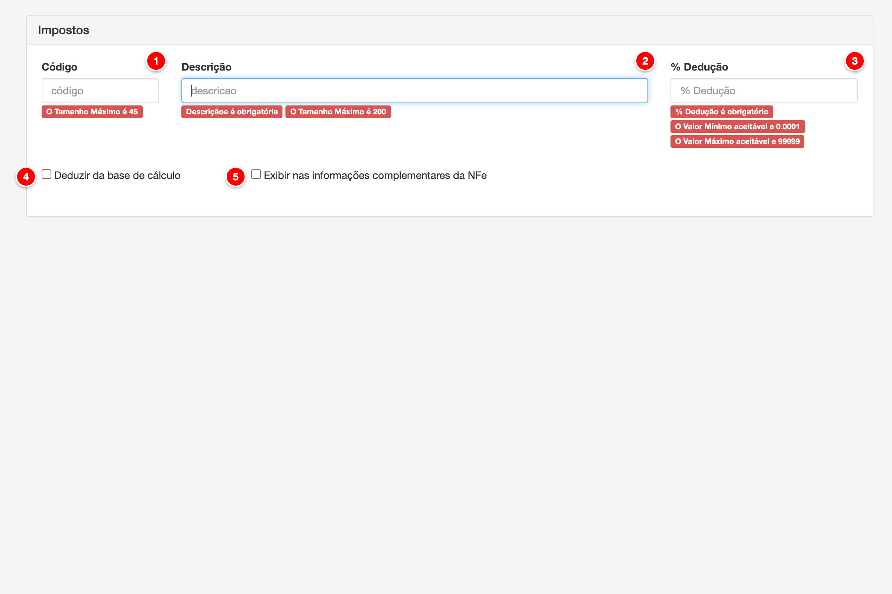
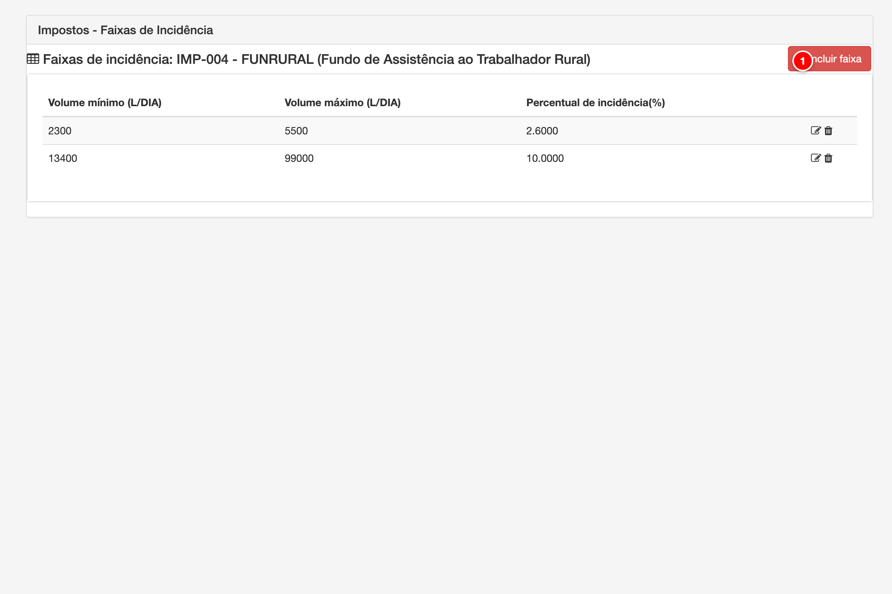
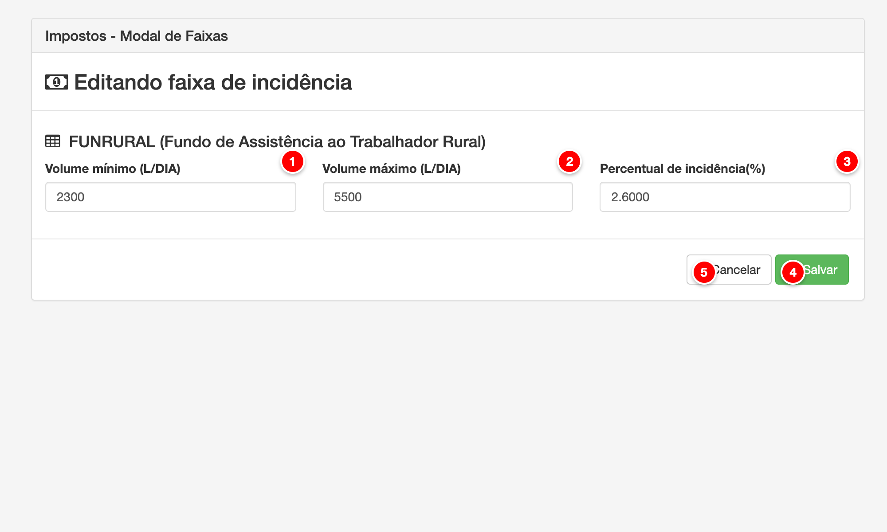

# Impostos

Os impostos são configurações que definem os percentuais de dedução que serão aplicados no cálculo da folha de pagamento. Cada imposto pode ser configurado com um percentual específico, tipo de base de cálculo (valor bruto ou líquido), e opções para dedução da base de cálculo e exibição nas informações complementares da NFe.

<figure>
  
  <figcaption>Tela de impostos do módulo Pay</figcaption>
</figure>

> **Nota**: Tela de cadastro e edição de impostos com os campos principais numerados para referência.

## Descrição dos Elementos

Seguindo a numeração presente na imagem acima:

**1. Código**

Campo de texto que identifica unicamente o imposto dentro da conta.

**Como ajustar:**
- Acesse o menu Pagamento > Impostos
- Clique em "Novo" ou edite um imposto existente
- No campo "Código", digite um código único (máximo 45 caracteres)
- O código é opcional e pode ser deixado em branco

**Para que serve:**
O código serve como identificador opcional do imposto, permitindo referenciar o imposto em outros módulos do sistema. Facilita a organização e busca de impostos quando há múltiplos impostos cadastrados.

**Como afeta o cálculo:**
O código não afeta diretamente os cálculos da folha de pagamento, mas é útil para identificar qual imposto está sendo aplicado. O imposto selecionado determina o percentual de dedução que será aplicado no cálculo do pagamento.

---

**2. Descrição**

Campo de texto obrigatório que descreve o tipo de imposto.

**Como ajustar:**
- Acesse o menu Pagamento > Impostos
- Clique em "Novo" ou edite um imposto existente
- No campo "Descrição", digite o nome do imposto (máximo 200 caracteres)
- O campo é obrigatório e deve ser preenchido antes de salvar

**Para que serve:**
A descrição identifica o tipo de imposto que será aplicado, como "Senar", "Funrural", "SAT", etc. Esta informação é exibida na folha de pagamento e nas notas fiscais para identificar qual imposto foi deduzido.

**Como afeta o cálculo:**
A descrição não afeta diretamente os cálculos, mas é essencial para identificar qual imposto está sendo aplicado. O imposto selecionado determina o percentual de dedução que será aplicado no cálculo do pagamento.

---

**3. % Dedução**

Campo numérico obrigatório que define o percentual de dedução do imposto.

**Como ajustar:**
- Acesse o menu Pagamento > Impostos
- Clique em "Novo" ou edite um imposto existente
- No campo "% Dedução", digite o percentual (ex: 0.2000 para 0,2%)
- O valor mínimo aceitável é 0.0001 e o máximo é 99999
- O campo é obrigatório e deve ser preenchido antes de salvar

**Para que serve:**
O percentual de dedução define quanto será deduzido do valor base de cálculo. Este valor é aplicado sobre a base de cálculo (valor bruto ou líquido, conforme configurado) para calcular o valor do imposto a ser deduzido.

**Como afeta o cálculo:**
O percentual de dedução é diretamente aplicado na base de cálculo do imposto. Por exemplo, se o percentual for 0.2000 (0,2%) e a base de cálculo for R$ 10.000,00, o valor do imposto será R$ 20,00. Este valor é deduzido do valor total a ser pago ao produtor.

---

**4. Deduzir da base de cálculo**

Checkbox que indica se o imposto deve ser deduzido da base de cálculo da nota fiscal.

**Como ajustar:**
- Acesse o menu Pagamento > Impostos
- Clique em "Novo" ou edite um imposto existente
- Marque ou desmarque o checkbox "Deduzir da base de cálculo"
- Por padrão, este campo vem marcado

**Para que serve:**
Quando marcado, indica que o valor do imposto deve ser deduzido da base de cálculo da nota fiscal. Isso afeta como os impostos são calculados em cascata, onde um imposto pode reduzir a base de cálculo de outros impostos.

**Como afeta o cálculo:**
Se marcado, o valor do imposto é deduzido da base de cálculo antes de calcular outros impostos. Isso permite que os impostos sejam calculados de forma sequencial, onde cada imposto reduz a base para o próximo. Se desmarcado, o imposto é calculado sobre a base original sem afetar a base de cálculo de outros impostos.

---

**5. Exibir nas informações complementares da NFe**

Checkbox que indica se o imposto deve ser detalhado nas informações complementares da nota fiscal.

**Como ajustar:**
- Acesse o menu Pagamento > Impostos
- Clique em "Novo" ou edite um imposto existente
- Marque ou desmarque o checkbox "Exibir nas informações complementares da NFe"
- Por padrão, este campo vem desmarcado

**Para que serve:**
Quando marcado, o imposto será detalhado nas informações complementares da nota fiscal eletrônica, permitindo que o cliente visualize quais impostos foram deduzidos e seus respectivos valores.

**Como afeta o cálculo:**
Este campo não afeta diretamente os cálculos da folha de pagamento, mas controla a apresentação dos impostos na nota fiscal. Apenas afeta a forma como as informações são exibidas ao cliente, não alterando os valores calculados.

---

## Funcionalidades Adicionais

### Base de Cálculo

O sistema permite configurar se o imposto será calculado sobre o valor bruto ou sobre o valor líquido. Esta configuração é definida no campo "Base de Cálculo" (tipo_valor_base), que pode ser:
- **B (Valor Bruto)**: O imposto é calculado sobre o valor bruto antes de deduções
- **L (Valor Líquido)**: O imposto é calculado sobre o valor líquido após outras deduções

### Faixas de Incidência

Cada imposto pode ter múltiplas faixas de incidência configuradas, definindo diferentes percentuais de dedução baseados no volume diário de produção. As faixas permitem que o imposto seja calculado de forma progressiva ou diferenciada conforme o volume produzido.

<figure>
  
  <figcaption>Tela de faixas de incidência de impostos</figcaption>
</figure>

> **Nota**: Tela de listagem de faixas de incidência com os elementos principais numerados para referência.

#### Descrição dos Elementos da Tabela de Faixas

**1. Incluir faixa**

Botão que abre o modal para adicionar uma nova faixa de incidência ao imposto.

**Como ajustar:**
- Acesse o menu Pagamento > Impostos
- Edite um imposto existente
- Clique na aba "Incidência"
- Clique no botão "Incluir faixa"
- Preencha os campos do modal e clique em "Salvar"

**Para que serve:**
Permite adicionar novas faixas de incidência que definem diferentes percentuais de dedução baseados no volume diário de produção. Cada faixa define um intervalo de volume (mínimo e máximo) e o percentual de incidência aplicado nesse intervalo.

**Como afeta o cálculo:**
As faixas determinam qual percentual de dedução será aplicado ao imposto baseado no volume diário de produção do produtor. O sistema verifica em qual faixa o volume se enquadra e aplica o percentual correspondente. Isso permite criar sistemas de cálculo progressivos ou diferenciados.

---

**2. Editar faixa**

Ícone de lápis que permite editar uma faixa de incidência existente.

**Como ajustar:**
- Na tabela de faixas, localize a faixa que deseja editar
- Clique no ícone de lápis (✏️) na linha da faixa
- O modal de edição será aberto com os dados da faixa preenchidos
- Modifique os campos desejados (Volume mínimo, Volume máximo, Percentual)
- Clique em "Salvar" para confirmar as alterações

**Para que serve:**
Permite modificar faixas de incidência já cadastradas, ajustando os intervalos de volume ou os percentuais de dedução conforme necessário. Isso é útil quando há mudanças nas regras de cálculo ou quando é necessário corrigir configurações incorretas.

**Como afeta o cálculo:**
As alterações nas faixas afetam imediatamente os cálculos da folha de pagamento. Quando uma faixa é editada, o sistema passa a usar os novos valores (volume mínimo, volume máximo e percentual) para determinar qual percentual aplicar aos produtores cujo volume diário se enquadra na faixa modificada.

---

**3. Excluir faixa**

Ícone de lixeira que permite excluir uma faixa de incidência.

**Como ajustar:**
- Na tabela de faixas, localize a faixa que deseja excluir
- Clique no ícone de lixeira (🗑️) na linha da faixa
- Confirme a exclusão quando solicitado
- A faixa será removida permanentemente do sistema

**Para que serve:**
Permite remover faixas de incidência que não são mais necessárias ou que foram cadastradas incorretamente. A exclusão é permanente e não pode ser desfeita, então é importante verificar se a faixa não está sendo utilizada em cálculos antes de excluí-la.

**Como afeta o cálculo:**
Quando uma faixa é excluída, o sistema deixa de considerar essa faixa nos cálculos da folha de pagamento. Produtores cujo volume diário se enquadrava apenas na faixa excluída podem não ter nenhuma faixa aplicável, resultando em cálculo sem dedução de imposto para aquela faixa específica. É importante garantir que haja outras faixas que cubram todos os volumes possíveis.

---

#### Modal de Inclusão/Edição de Faixas

<figure>
  
  <figcaption>Modal de inclusão e edição de faixas de incidência</figcaption>
</figure>

> **Nota**: Modal para cadastro e edição de faixas de incidência com os campos principais numerados para referência.

**1. Volume mínimo (L/DIA)**

Campo numérico obrigatório que define o volume mínimo diário (em litros) para que a faixa seja aplicada.

**Como ajustar:**
- No modal de faixas, digite o volume mínimo em litros por dia
- O campo é obrigatório e deve ser preenchido
- Exemplo: 300 (para 300 litros por dia)

**Para que serve:**
Define o limite inferior do intervalo de volume para aplicação da faixa. O sistema verifica se o volume diário do produtor é maior ou igual a este valor para considerar a faixa.

**Como afeta o cálculo:**
O volume mínimo determina a partir de qual volume diário a faixa será aplicada. Se o volume do produtor estiver abaixo deste valor, a faixa não será considerada. Se estiver dentro do intervalo (entre mínimo e máximo), o percentual da faixa será aplicado.

---

**2. Volume máximo (L/DIA)**

Campo numérico obrigatório que define o volume máximo diário (em litros) para que a faixa seja aplicada.

**Como ajustar:**
- No modal de faixas, digite o volume máximo em litros por dia
- O campo é obrigatório e deve ser preenchido
- Exemplo: 1200 (para 1200 litros por dia)

**Para que serve:**
Define o limite superior do intervalo de volume para aplicação da faixa. O sistema verifica se o volume diário do produtor é menor ou igual a este valor para considerar a faixa.

**Como afeta o cálculo:**
O volume máximo determina até qual volume diário a faixa será aplicada. Se o volume do produtor estiver acima deste valor, a faixa não será considerada. Se estiver dentro do intervalo (entre mínimo e máximo), o percentual da faixa será aplicado.

---

**3. Percentual de incidência (%)**

Campo numérico obrigatório que define o percentual de dedução do imposto para esta faixa de volume.

**Como ajustar:**
- No modal de faixas, digite o percentual de incidência (com 4 casas decimais)
- O campo é obrigatório e deve ser preenchido
- Exemplo: 2.0000 (para 2%)

**Para que serve:**
Define o percentual de dedução que será aplicado quando o volume diário do produtor estiver dentro do intervalo definido pela faixa (entre volume mínimo e máximo).

**Como afeta o cálculo:**
O percentual de incidência é aplicado sobre a base de cálculo do imposto quando o volume diário do produtor se enquadra na faixa. Por exemplo, se a faixa for de 300 a 1200 L/DIA com percentual de 2.0000%, e o produtor tiver volume de 500 L/DIA, o percentual de 2% será aplicado ao cálculo do imposto.

---

**4. Salvar**

Botão que salva a faixa de incidência no banco de dados.

**Como ajustar:**
- Após preencher todos os campos obrigatórios, clique em "Salvar"
- A faixa será adicionada ou atualizada conforme o caso
- O modal será fechado automaticamente após o salvamento

**Para que serve:**
Salva a configuração da faixa de incidência, permitindo que ela seja utilizada nos cálculos da folha de pagamento. A faixa ficará disponível na tabela de faixas do imposto.

**Como afeta o cálculo:**
Após salvar, a faixa passa a ser considerada nos cálculos da folha de pagamento. O sistema verifica o volume diário de cada produtor e aplica o percentual da faixa correspondente ao calcular os impostos.

---

#### Funcionalidades da Tabela de Faixas

A tabela de faixas exibe todas as faixas de incidência configuradas para o imposto, mostrando:
- **Volume mínimo (L/DIA)**: Volume mínimo da faixa
- **Volume máximo (L/DIA)**: Volume máximo da faixa
- **Percentual de incidência (%)**: Percentual aplicado na faixa
- **Ações**: Ícones para editar e excluir faixas (quando em modo de edição)

As faixas podem ser editadas clicando no ícone de lápis ou excluídas clicando no ícone de lixeira. A ordem das faixas é importante, pois o sistema verifica as faixas na ordem em que aparecem na tabela.

---

### Incidência de Impostos

Cada imposto pode ter múltiplas incidências configuradas, definindo em quais situações o imposto será aplicado. As incidências são configuradas na aba "Incidência" do formulário de edição do imposto através das faixas de volume.

### Aplicação em Contratos

Os impostos podem ser vinculados a contratos específicos através da aba "Impostos" no formulário de contratos. Isso permite que diferentes contratos tenham diferentes configurações de impostos aplicadas.

---

## Exemplos de Uso

### Exemplo 1: Configuração do Imposto Senar

1. Acesse o menu Pagamento > Impostos
2. Clique em "Novo"
3. Preencha os campos:
   - **Descrição**: "Senar"
   - **% Dedução**: "0.2000" (0,2%)
   - **Deduzir da base de cálculo**: Marcado
   - **Exibir nas informações complementares da NFe**: Desmarcado
4. Clique em "Salvar"

### Exemplo 2: Configuração do Imposto Funrural

1. Acesse o menu Pagamento > Impostos
2. Clique em "Novo"
3. Preencha os campos:
   - **Descrição**: "Funrural"
   - **% Dedução**: "1.2000" (1,2%)
   - **Deduzir da base de cálculo**: Marcado
   - **Exibir nas informações complementares da NFe**: Marcado
4. Clique em "Salvar"

---

## Observações Importantes

- Os impostos são aplicados na ordem configurada, e cada imposto pode afetar a base de cálculo do próximo se a opção "Deduzir da base de cálculo" estiver marcada.
- O percentual de dedução deve ser informado com 4 casas decimais (ex: 0.2000 para 0,2%).
- Os impostos podem ser vinculados a contratos específicos, permitindo diferentes configurações para diferentes produtores.
- A configuração de incidências permite definir em quais situações cada imposto será aplicado.
