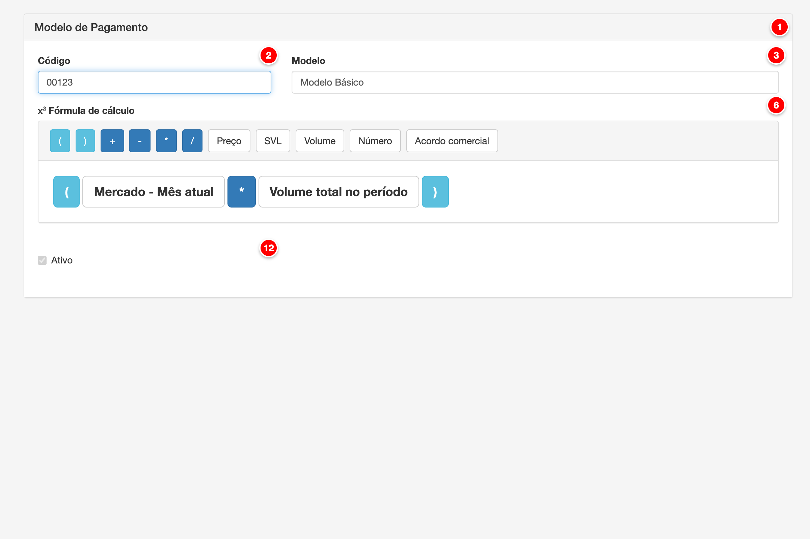

# Modelos de pagamento

Os modelos de pagamento definem as fórmulas de cálculo utilizadas para determinar o valor a ser pago aos produtores na folha de pagamento. Cada modelo é composto por uma fórmula que combina diferentes elementos como preços, volumes, indicadores de qualidade (SVL), acordos comerciais e operadores matemáticos.

<figure>
  
  <figcaption>Tela de modelos de pagamento do módulo Pay</figcaption>
</figure>

> **Nota**: A imagem acima foi gerada automaticamente com bullets numerados e dados reais do banco de dados (conta_id = 40001). Para regenerar a imagem, execute:
> ```bash
> node scripts/generate-form-image.js --config content-metadata/modelos-de-pagamento-image-config.json
> ```
> O script requer Puppeteer instalado (`npm install puppeteer`). A imagem é processada automaticamente pelo GitBook quando sincronizada via GitSync.

## Descrição dos Elementos

Seguindo a numeração presente na imagem acima:

**1. Código**

Campo de texto que identifica unicamente o modelo de pagamento dentro da conta.

**Como ajustar:**
- Acesse o menu Pagamento > Modelos de Pagamento
- Clique em "Novo modelo" ou edite um modelo existente
- No campo "Código", digite um código único (máximo 15 caracteres)
- O código é obrigatório e não pode ser duplicado na mesma conta

**Para que serve:**
O código serve como identificador único do modelo de pagamento, permitindo referenciar o modelo em contratos e outros módulos do sistema. Facilita a organização e busca de modelos quando há múltiplos modelos cadastrados.

**Como afeta o cálculo:**
O código não afeta diretamente os cálculos da folha de pagamento, mas é essencial para identificar qual modelo será aplicado a cada contrato. O modelo selecionado no contrato determina qual fórmula será utilizada para calcular o pagamento do produtor.

---

**2. Modelo**

Campo de texto que define o nome ou descrição do modelo de pagamento.

**Como ajustar:**
- Acesse o menu Pagamento > Modelos de Pagamento
- No campo "Modelo", digite o nome descritivo do modelo (máximo 255 caracteres)
- Exemplos: "80% CEPEA", "83% CEPEA", "Modelo Premium"
- O nome é obrigatório e não pode ser duplicado na mesma conta

**Para que serve:**
O nome do modelo permite identificar facilmente o tipo de cálculo que será aplicado. Facilita a seleção do modelo correto ao configurar contratos e ajuda na organização dos diferentes modelos disponíveis.

**Como afeta o cálculo:**
O nome não afeta os cálculos, mas é importante para identificar qual modelo está sendo utilizado. Cada modelo possui uma fórmula única que determina como o pagamento será calculado.

---

**3. Fórmula de cálculo**

Editor visual que permite construir a fórmula de cálculo do modelo de pagamento através de uma interface gráfica com botões e elementos arrastáveis.

**Como ajustar:**
- Acesse o menu Pagamento > Modelos de Pagamento
- Clique em "Novo modelo" ou edite um modelo existente
- Na seção "Fórmula de cálculo", use os botões disponíveis para adicionar elementos à fórmula:
  - Clique nos botões de operadores matemáticos (+, -, *, /)
  - Clique nos botões de elementos (Preço, SVL, Volume, Número, Acordo comercial)
  - Arraste os elementos para reorganizar a ordem
  - Use os parênteses para agrupar operações
- Clique em "Salvar" para aplicar as alterações

**Para que serve:**
A fórmula de cálculo define como o valor do pagamento será calculado para cada produtor. Permite combinar diferentes elementos (preços, volumes, indicadores de qualidade) usando operadores matemáticos para criar fórmulas complexas e personalizadas.

**Como afeta o cálculo:**
A fórmula é o componente central que determina o valor do pagamento. Durante o cálculo da folha, o sistema processa cada elemento da fórmula na ordem definida, aplicando os operadores matemáticos e substituindo os elementos pelos valores reais (preços, volumes, indicadores SVL, etc.), resultando no valor final a ser pago ao produtor.

---

**4. Parêntese de abertura (**

Operador que inicia um agrupamento de elementos na fórmula, permitindo definir a precedência das operações matemáticas.

**Como ajustar:**
- Na seção "Fórmula de cálculo", clique no botão "("
- O parêntese será adicionado à fórmula
- Adicione os elementos que deseja agrupar após o parêntese
- Feche o agrupamento com o parêntese de fechamento ")"

**Para que serve:**
Os parênteses permitem agrupar operações matemáticas e definir a ordem de precedência dos cálculos. Isso é essencial para criar fórmulas complexas onde certas operações devem ser calculadas antes de outras.

**Como afeta o cálculo:**
Os parênteses afetam diretamente os cálculos da folha de pagamento ao definir a ordem de execução das operações. O sistema calcula primeiro as operações dentro dos parênteses, seguindo a precedência matemática padrão. Isso permite criar fórmulas como "(Preço * Volume) + Bônus" onde a multiplicação é feita antes da adição.

---

**5. Parêntese de fechamento )**

Operador que fecha um agrupamento de elementos na fórmula, finalizando a precedência das operações matemáticas.

**Como ajustar:**
- Na seção "Fórmula de cálculo", após adicionar elementos agrupados, clique no botão ")"
- O parêntese será adicionado à fórmula, fechando o agrupamento iniciado por "("
- Certifique-se de que cada parêntese de abertura tenha um correspondente de fechamento

**Para que serve:**
O parêntese de fechamento finaliza o agrupamento iniciado pelo parêntese de abertura, permitindo que o sistema saiba onde termina a precedência daquele grupo de operações.

**Como afeta o cálculo:**
O parêntese de fechamento é essencial para o cálculo correto da fórmula. Sem ele, a fórmula pode resultar em erro ou cálculo incorreto. O sistema valida que todos os parênteses de abertura tenham correspondentes de fechamento antes de processar a fórmula.

---

**6. Adição (+)**

Operador matemático que soma dois valores na fórmula de cálculo.

**Como ajustar:**
- Na seção "Fórmula de cálculo", clique no botão "+"
- O operador será adicionado entre os elementos da fórmula
- Posicione o operador entre os valores que deseja somar

**Para que serve:**
O operador de adição permite somar diferentes componentes do pagamento, como preço base, bônus de qualidade, acordos comerciais, etc. É fundamental para construir fórmulas que combinam múltiplos elementos.

**Como afeta o cálculo:**
O operador de adição afeta diretamente os cálculos da folha de pagamento ao somar os valores dos elementos que o precedem e sucedem. Por exemplo, em uma fórmula como "Preço + Bônus", o sistema calcula o valor do preço, calcula o valor do bônus, e então soma os dois valores para obter o resultado final.

---

**7. Subtração (-)**

Operador matemático que subtrai um valor de outro na fórmula de cálculo.

**Como ajustar:**
- Na seção "Fórmula de cálculo", clique no botão "-"
- O operador será adicionado entre os elementos da fórmula
- Posicione o operador entre os valores, onde o valor à direita será subtraído do valor à esquerda

**Para que serve:**
O operador de subtração permite descontar valores do pagamento, como descontos por qualidade, penalidades, ou ajustes negativos. Permite criar fórmulas que reduzem o valor base do pagamento.

**Como afeta o cálculo:**
O operador de subtração afeta diretamente os cálculos da folha de pagamento ao subtrair o valor do elemento à direita do valor do elemento à esquerda. Por exemplo, em "Preço - Desconto", o sistema calcula o preço, calcula o desconto, e então subtrai o desconto do preço.

---

**8. Multiplicação (*)**

Operador matemático que multiplica dois valores na fórmula de cálculo.

**Como ajustar:**
- Na seção "Fórmula de cálculo", clique no botão "*"
- O operador será adicionado entre os elementos da fórmula
- Posicione o operador entre os valores que deseja multiplicar

**Para que serve:**
O operador de multiplicação é essencial para calcular valores proporcionais, como preço por litro multiplicado pelo volume, ou percentuais aplicados sobre valores base. É amplamente utilizado em fórmulas de pagamento.

**Como afeta o cálculo:**
O operador de multiplicação afeta diretamente os cálculos da folha de pagamento ao multiplicar os valores dos elementos. Por exemplo, em "Preço * Volume", o sistema calcula o preço por litro, obtém o volume fornecido, e então multiplica os dois valores para obter o valor total do pagamento.

---

**9. Divisão (/)**

Operador matemático que divide um valor por outro na fórmula de cálculo.

**Como ajustar:**
- Na seção "Fórmula de cálculo", clique no botão "/"
- O operador será adicionado entre os elementos da fórmula
- Posicione o operador entre os valores, onde o valor à esquerda será dividido pelo valor à direita

**Para que serve:**
O operador de divisão permite calcular valores unitários, médias, ou aplicar divisores em fórmulas. É útil para calcular preços médios, percentuais, ou valores proporcionais.

**Como afeta o cálculo:**
O operador de divisão afeta diretamente os cálculos da folha de pagamento ao dividir o valor do elemento à esquerda pelo valor do elemento à direita. O sistema valida que o divisor não seja zero para evitar erros de cálculo. Por exemplo, em "Total / Volume", o sistema calcula o preço médio por litro.

---

**10. Preço**

Dropdown que permite selecionar uma tabela de preço cadastrada no sistema para usar na fórmula, com opção de mês atual ou mês anterior.

**Como ajustar:**
- Na seção "Fórmula de cálculo", clique no botão "Preço"
- Selecione uma tabela de preço da lista:
  - "[Nome da Tabela] - Mês atual": Usa o preço da tabela no mês de referência da folha
  - "[Nome da Tabela] - Mês anterior": Usa o preço da tabela no mês anterior ao de referência
- O elemento será adicionado à fórmula

**Para que serve:**
O elemento de preço permite referenciar valores de tabelas de preço cadastradas no sistema, como índices CEPEA ou outras tabelas de referência. Permite usar preços atualizados automaticamente conforme as tabelas são atualizadas.

**Como afeta o cálculo:**
O elemento de preço afeta diretamente os cálculos da folha de pagamento ao substituir o elemento pelo valor da tabela de preço selecionada no período de referência. O sistema busca o preço correspondente na tabela para o mês especificado (atual ou anterior) e utiliza esse valor na fórmula. Este valor é então multiplicado, somado ou combinado com outros elementos conforme a fórmula definida.

---

**11. SVL**

Dropdown que permite selecionar um elemento do Sistema de Valorização do Leite (SVL) para incluir na fórmula.

**Como ajustar:**
- Na seção "Fórmula de cálculo", clique no botão "SVL"
- Selecione um dos elementos disponíveis:
  - Produção do contrato
  - Produção individual
  - Produção associada
  - CPP (Contagem de Células Patogênicas)
  - CCS (Contagem de Células Somáticas)
  - Proteína
  - Gordura
  - Temperatura
  - Fidelidade
  - Logística
  - Certificação
  - Projetos
  - Gestão
- O elemento será adicionado à fórmula

**Para que serve:**
O SVL (Sistema de Valorização do Leite) permite incluir indicadores de qualidade, produção e bônus na fórmula de pagamento. Cada elemento SVL representa um valor calculado com base em análises laboratoriais, volumes fornecidos, ou critérios de gestão e certificação.

**Como afeta o cálculo:**
Cada elemento SVL afeta os cálculos da folha de pagamento de forma específica. O sistema calcula o valor de cada elemento SVL com base em dados reais (análises, volumes, contratos) e substitui o elemento na fórmula por esse valor calculado. Os valores podem ser positivos (bônus) ou negativos (descontos), impactando diretamente o valor final do pagamento.

---

**12. Volume**

Dropdown que permite selecionar um tipo de volume para usar na fórmula de cálculo.

**Como ajustar:**
- Na seção "Fórmula de cálculo", clique no botão "Volume"
- Selecione uma das opções disponíveis:
  - Volume total no período: Volume total fornecido no período de referência
  - Média diária do volume no período: Média calculada do volume diário
  - Volume total fora do padrão: Volume que não atende aos padrões de qualidade
- O elemento será adicionado à fórmula

**Para que serve:**
O elemento de volume permite referenciar diferentes métricas de volume de leite fornecido pelo produtor. Esses valores são essenciais para calcular pagamentos proporcionais ao volume fornecido.

**Como afeta o cálculo:**
O elemento de volume afeta diretamente os cálculos da folha de pagamento ao substituir o elemento pelo volume real fornecido pelo produtor no período de referência. O sistema busca o volume correspondente (total, média diária, ou fora do padrão) e utiliza esse valor na fórmula. Este valor é frequentemente multiplicado por preços ou outros elementos para calcular o valor total do pagamento.

---

**13. Número**

Modal que permite inserir um valor numérico fixo na fórmula de cálculo.

**Como ajustar:**
- Na seção "Fórmula de cálculo", clique no botão "Número"
- No modal que abrir, digite o valor numérico desejado
- Clique em "Confirmar" para adicionar o número à fórmula
- O número pode ser editado posteriormente clicando no elemento e selecionando "Editar"

**Para que serve:**
O elemento numérico permite incluir valores fixos na fórmula, como percentuais (0.8 para 80%), multiplicadores, ou constantes matemáticas. É útil para aplicar percentuais sobre preços, definir fatores de correção, ou incluir valores fixos no cálculo.

**Como afeta o cálculo:**
O elemento numérico afeta diretamente os cálculos da folha de pagamento ao substituir o elemento pelo valor numérico informado. Por exemplo, ao usar "0.8 * Preço", o sistema multiplica o preço por 0.8, resultando em 80% do preço. Os números são utilizados exatamente como informados, sem arredondamentos intermediários.

---

**14. Acordo comercial**

Dropdown que permite selecionar um acordo comercial para incluir na fórmula de cálculo.

**Como ajustar:**
- Na seção "Fórmula de cálculo", clique no botão "Acordo comercial"
- Selecione uma das opções disponíveis:
  - Acordo * Volume total: Multiplica o acordo comercial pelo volume total
  - Acordo/L: Usa o valor do acordo comercial por litro
- O elemento será adicionado à fórmula

**Para que serve:**
O elemento de acordo comercial permite incluir valores de acordos comerciais específicos configurados para o produtor ou contrato. Esses acordos podem representar valores adicionais, descontos, ou ajustes comerciais negociados.

**Como afeta o cálculo:**
O elemento de acordo comercial afeta os cálculos da folha de pagamento ao substituir o elemento pelo valor do acordo comercial configurado. Se selecionado "Acordo * Volume total", o sistema multiplica o valor do acordo pelo volume fornecido. Se selecionado "Acordo/L", o sistema usa o valor unitário do acordo por litro. O valor é então combinado com outros elementos da fórmula conforme definido.

---

**15. Ativo**

Checkbox que define se o modelo de pagamento está ativo e disponível para uso em contratos.

**Como ajustar:**
- Acesse o menu Pagamento > Modelos de Pagamento
- Edite o modelo desejado
- Marque ou desmarque o checkbox "Ativo"
- Clique em "Salvar" para aplicar as alterações

**Para que serve:**
O status ativo/inativo permite controlar quais modelos de pagamento estão disponíveis para seleção em contratos. Modelos inativos não aparecem nas listas de seleção, mas permanecem no sistema para histórico e referência.

**Como afeta o cálculo:**
O status ativo não afeta diretamente os cálculos da folha de pagamento, mas impede que novos contratos sejam criados usando modelos inativos. Contratos existentes que já utilizam um modelo continuam funcionando normalmente mesmo se o modelo for desativado posteriormente. Isso permite manter histórico e evitar que modelos em uso sejam acidentalmente removidos.

---

## Elementos do Sistema de Valorização do Leite (SVL)

Os elementos SVL representam diferentes aspectos da qualidade, produção e gestão que podem ser incluídos na fórmula de pagamento:

**16. Produção do contrato (SVL_VF)**

Elemento que representa o volume fornecido calculado com base no contrato do produtor.

**Como ajustar:**
- Na seção "Fórmula de cálculo", clique em "SVL" > "Produção do contrato"
- O elemento será adicionado à fórmula

**Para que serve:**
Representa o volume de leite fornecido pelo produtor no período, calculado conforme as regras definidas no contrato. É a base para cálculos proporcionais ao volume fornecido.

**Como afeta o cálculo:**
O sistema calcula o volume fornecido com base nas coletas do período, considerando as configurações do contrato (volume informado vs. quantidade coletada, desconto de água, etc.). Este valor é então utilizado na fórmula conforme os operadores matemáticos definidos.

---

**17. Produção individual (SVL_VFI)**

Elemento que representa o volume fornecido individual do produtor, sem considerar produção associada.

**Como ajustar:**
- Na seção "Fórmula de cálculo", clique em "SVL" > "Produção individual"
- O elemento será adicionado à fórmula

**Para que serve:**
Representa apenas o volume fornecido diretamente pelo produtor, excluindo volumes de produção associada ou coletiva. Útil para modelos que diferenciam produção própria de produção associada.

**Como afeta o cálculo:**
O sistema calcula apenas o volume individual do produtor, excluindo volumes de produção associada. Este valor é utilizado na fórmula, permitindo criar modelos que valorizam diferentemente a produção individual versus associada.

---

**18. Produção associada (SVL_VFA)**

Elemento que representa o volume fornecido através de produção associada ou coletiva.

**Como ajustar:**
- Na seção "Fórmula de cálculo", clique em "SVL" > "Produção associada"
- O elemento será adicionado à fórmula

**Para que serve:**
Representa o volume de leite fornecido através de produção associada, onde múltiplos produtores contribuem para um volume coletivo. Permite criar modelos que valorizam diferentemente a produção associada.

**Como afeta o cálculo:**
O sistema calcula o volume de produção associada do produtor no período. Este valor é utilizado na fórmula, permitindo aplicar diferentes critérios de valorização para produção associada versus individual.

---

**19. CPP - Contagem de Células Patogênicas (SVL_CPP)**

Elemento que representa o valor calculado com base na contagem de células patogênicas nas análises do leite.

**Como ajustar:**
- Na seção "Fórmula de cálculo", clique em "SVL" > "CPP"
- O elemento será adicionado à fórmula
- Para configurar como composição, clique no elemento e selecione "Composição"

**Para que serve:**
O CPP é um indicador de qualidade do leite que mede a contagem de células patogênicas. Valores menores indicam melhor qualidade. Este elemento permite incluir bônus ou descontos baseados na qualidade medida pelo CPP.

**Como afeta o cálculo:**
O sistema calcula o valor do CPP com base nas análises laboratoriais do período, aplicando as regras de valorização configuradas no sistema SVL. Este valor (que pode ser positivo para bônus ou negativo para descontos) é então utilizado na fórmula, impactando diretamente o valor do pagamento conforme a qualidade do leite.

---

**20. CCS - Contagem de Células Somáticas (SVL_CCS)**

Elemento que representa o valor calculado com base na contagem de células somáticas nas análises do leite.

**Como ajustar:**
- Na seção "Fórmula de cálculo", clique em "SVL" > "CCS"
- O elemento será adicionado à fórmula
- Para configurar como composição, clique no elemento e selecione "Composição"

**Para que serve:**
O CCS é um indicador de qualidade do leite que mede a contagem de células somáticas. Valores menores indicam melhor qualidade e saúde do rebanho. Este elemento permite incluir bônus ou descontos baseados na qualidade medida pelo CCS.

**Como afeta o cálculo:**
O sistema calcula o valor do CCS com base nas análises laboratoriais do período, aplicando as regras de valorização configuradas no sistema SVL. Este valor (que pode ser positivo para bônus ou negativo para descontos) é então utilizado na fórmula, impactando diretamente o valor do pagamento conforme a qualidade do leite medida pelo CCS.

---

**21. Proteína (SVL_PROT)**

Elemento que representa o valor calculado com base no teor de proteína nas análises do leite.

**Como ajustar:**
- Na seção "Fórmula de cálculo", clique em "SVL" > "Proteína"
- O elemento será adicionado à fórmula
- Para configurar como composição, clique no elemento e selecione "Composição"

**Para que serve:**
A proteína é um componente importante do leite que afeta seu valor comercial. Maiores teores de proteína geralmente resultam em maior valorização. Este elemento permite incluir bônus baseados no teor de proteína do leite.

**Como afeta o cálculo:**
O sistema calcula o valor da proteína com base nas análises laboratoriais do período, aplicando as regras de valorização configuradas no sistema SVL. Este valor (geralmente positivo como bônus) é então utilizado na fórmula, aumentando o valor do pagamento conforme o teor de proteína do leite.

---

**22. Gordura (SVL_GOR)**

Elemento que representa o valor calculado com base no teor de gordura nas análises do leite.

**Como ajustar:**
- Na seção "Fórmula de cálculo", clique em "SVL" > "Gordura"
- O elemento será adicionado à fórmula
- Para configurar como composição, clique no elemento e selecione "Composição"

**Para que serve:**
A gordura é um componente importante do leite que afeta seu valor comercial. Maiores teores de gordura geralmente resultam em maior valorização. Este elemento permite incluir bônus baseados no teor de gordura do leite.

**Como afeta o cálculo:**
O sistema calcula o valor da gordura com base nas análises laboratoriais do período, aplicando as regras de valorização configuradas no sistema SVL. Este valor (geralmente positivo como bônus) é então utilizado na fórmula, aumentando o valor do pagamento conforme o teor de gordura do leite.

---

**23. Temperatura (SVL_TEMP)**

Elemento que representa o valor calculado com base na temperatura média do leite nas coletas.

**Como ajustar:**
- Na seção "Fórmula de cálculo", clique em "SVL" > "Temperatura"
- O elemento será adicionado à fórmula
- Para configurar como composição, clique no elemento e selecione "Composição"

**Para que serve:**
A temperatura do leite é um indicador de qualidade e conservação. Temperaturas adequadas (geralmente baixas) indicam boa conservação e qualidade. Este elemento permite incluir bônus baseados na temperatura média do leite coletado.

**Como afeta o cálculo:**
O sistema calcula o valor da temperatura com base nas temperaturas registradas nas coletas do período, aplicando as regras de valorização configuradas no sistema SVL. Este valor (geralmente positivo como bônus para temperaturas adequadas) é então utilizado na fórmula, impactando o valor do pagamento conforme a qualidade da conservação do leite.

---

**24. Fidelidade (SVL_FID)**

Elemento que representa o valor calculado com base no indicador de fidelidade do produtor.

**Como ajustar:**
- Na seção "Fórmula de cálculo", clique em "SVL" > "Fidelidade"
- O elemento será adicionado à fórmula
- Para configurar como composição, clique no elemento e selecione "Composição"

**Para que serve:**
O indicador de fidelidade mede a regularidade e consistência do fornecimento do produtor. Produtores com maior fidelidade (fornecimento regular e consistente) podem receber bônus. Este elemento permite incluir bônus de fidelidade no pagamento.

**Como afeta o cálculo:**
O sistema calcula o valor de fidelidade com base em critérios configurados no sistema SVL (regularidade de fornecimento, consistência, etc.). Este valor (geralmente positivo como bônus) é então utilizado na fórmula, aumentando o valor do pagamento para produtores com maior fidelidade.

---

**25. Logística (SVL_LOG)**

Elemento que representa o valor calculado com base em indicadores logísticos do fornecimento.

**Como ajustar:**
- Na seção "Fórmula de cálculo", clique em "SVL" > "Logística"
- O elemento será adicionado à fórmula
- Para configurar como composição, clique no elemento e selecione "Composição"

**Para que serve:**
O indicador de logística mede aspectos relacionados à eficiência logística do fornecimento, como pontualidade, organização, facilidade de coleta, etc. Este elemento permite incluir bônus baseados em critérios logísticos.

**Como afeta o cálculo:**
O sistema calcula o valor de logística com base em critérios configurados no sistema SVL (pontualidade, organização, etc.). Este valor (geralmente positivo como bônus) é então utilizado na fórmula, aumentando o valor do pagamento para produtores que facilitam a logística de coleta.

---

**26. Certificação (SVL_CERT)**

Elemento que representa o valor calculado com base em certificações do produtor ou propriedade.

**Como ajustar:**
- Na seção "Fórmula de cálculo", clique em "SVL" > "Certificação"
- O elemento será adicionado à fórmula
- Para configurar como composição, clique no elemento e selecione "Composição"

**Para que serve:**
As certificações (orgânico, bem-estar animal, qualidade, etc.) agregam valor ao leite e podem justificar pagamentos diferenciados. Este elemento permite incluir bônus baseados em certificações do produtor.

**Como afeta o cálculo:**
O sistema calcula o valor de certificação com base nas certificações ativas do produtor ou propriedade, aplicando as regras de valorização configuradas no sistema SVL. Este valor (geralmente positivo como bônus) é então utilizado na fórmula, aumentando o valor do pagamento para produtores certificados.

---

**27. Projetos (SVL_PROJ)**

Elemento que representa o valor calculado com base na participação do produtor em projetos especiais.

**Como ajustar:**
- Na seção "Fórmula de cálculo", clique em "SVL" > "Projetos"
- O elemento será adicionado à fórmula
- Para configurar como composição, clique no elemento e selecione "Composição"

**Para que serve:**
A participação em projetos especiais (melhoria de qualidade, sustentabilidade, etc.) pode justificar bônus adicionais. Este elemento permite incluir bônus baseados na participação do produtor em projetos.

**Como afeta o cálculo:**
O sistema calcula o valor de projetos com base na participação ativa do produtor em projetos configurados no sistema SVL. Este valor (geralmente positivo como bônus) é então utilizado na fórmula, aumentando o valor do pagamento para produtores participantes de projetos.

---

**28. Gestão (SVL_GES)**

Elemento que representa o valor calculado com base em indicadores de gestão da propriedade.

**Como ajustar:**
- Na seção "Fórmula de cálculo", clique em "SVL" > "Gestão"
- O elemento será adicionado à fórmula
- Para configurar como composição, clique no elemento e selecione "Composição"

**Para que serve:**
Indicadores de gestão medem aspectos como organização da propriedade, uso de tecnologias, práticas de manejo, etc. Este elemento permite incluir bônus baseados em critérios de gestão.

**Como afeta o cálculo:**
O sistema calcula o valor de gestão com base em critérios configurados no sistema SVL (organização, tecnologias, práticas, etc.). Este valor (geralmente positivo como bônus) é então utilizado na fórmula, aumentando o valor do pagamento para produtores com melhor gestão.

---

## Composições

As composições permitem agrupar elementos da fórmula e configurar como eles serão apresentados e calculados:

**29. Criação de composições**

Funcionalidade que permite agrupar elementos da fórmula em uma composição nomeada, facilitando a organização e apresentação dos cálculos.

**Como ajustar:**
- Na seção "Fórmula de cálculo", adicione um parêntese de abertura "("
- Clique no parêntese e selecione "Composição"
- No modal que abrir, informe:
  - Nome da composição (obrigatório)
  - Código (opcional)
  - Tipo: Crédito, Débito ou Incentivo
  - Outras configurações conforme necessário
- Adicione os elementos que farão parte da composição entre os parênteses
- Feche a composição com o parêntese de fechamento ")"

**Para que serve:**
As composições permitem organizar a fórmula em grupos lógicos (ex: "Preço Base", "Bônus de Qualidade", "Acordos Comerciais") e configurar como cada grupo será apresentado no demonstrativo do produtor. Facilita a compreensão do cálculo e permite aplicar configurações específicas a cada grupo.

**Como afeta o cálculo:**
As composições não alteram o cálculo matemático da fórmula, mas organizam os elementos em grupos nomeados. Durante o cálculo, o sistema processa os elementos dentro da composição normalmente, mas ao gerar o demonstrativo, apresenta os valores agrupados conforme o nome da composição. Isso permite que o produtor veja claramente como o pagamento foi calculado por componente.

---

**30. Tipo de composição**

Configuração que define se a composição representa um crédito, débito ou incentivo no pagamento.

**Como ajustar:**
- Ao criar ou editar uma composição, no modal de configuração, selecione o tipo:
  - **Crédito (C)**: Valores que aumentam o pagamento
  - **Débito (D)**: Valores que diminuem o pagamento
  - **Incentivo (I)**: Valores de incentivo (não somados no montante principal)
- Clique em "Confirmar" para aplicar

**Para que serve:**
O tipo de composição classifica o valor calculado como crédito, débito ou incentivo. Isso afeta como o valor é apresentado no demonstrativo e como é tratado nos cálculos finais do pagamento.

**Como afeta o cálculo:**
O tipo de composição afeta os cálculos da folha de pagamento de forma importante:
- **Crédito (C)**: O valor é somado ao montante do pagamento
- **Débito (D)**: O valor é subtraído do montante do pagamento
- **Incentivo (I)**: O valor não é incluído no cálculo principal da fórmula (substituído por 0), mas é apresentado separadamente no demonstrativo. Isso permite mostrar incentivos sem afetar o valor base do pagamento.

---

**31. Deduzir incentivo**

Checkbox disponível para composições do tipo Crédito que define se o valor da composição deve ser deduzido do cálculo de incentivos.

**Como ajustar:**
- Ao criar ou editar uma composição do tipo Crédito, no modal de configuração
- Marque ou desmarque o checkbox "Deduzir incentivo"
- Clique em "Confirmar" para aplicar

**Para que serve:**
Quando habilitado, o valor desta composição é deduzido do cálculo de incentivos. Isso permite que certos créditos não sejam considerados como base para cálculo de incentivos adicionais, evitando duplicação ou distorções no cálculo.

**Como afeta o cálculo:**
Esta configuração afeta os cálculos da folha de pagamento ao modificar como os incentivos são calculados. Quando habilitada, o sistema deduz o valor desta composição antes de calcular os incentivos, resultando em valores de incentivo menores ou diferentes. Isso é útil quando certos créditos não devem servir de base para cálculo de incentivos.

---

**32. Exibir valor zerado**

Checkbox que define se a composição deve ser exibida no demonstrativo mesmo quando seu valor calculado for zero.

**Como ajustar:**
- Ao criar ou editar uma composição, no modal de configuração
- Marque ou desmarque o checkbox "Exibir mesmo se zerado"
- Clique em "Confirmar" para aplicar

**Para que serve:**
Quando habilitado, a composição sempre aparece no demonstrativo do produtor, mesmo quando o valor calculado for zero. Isso proporciona transparência, mostrando ao produtor todos os componentes do cálculo, incluindo aqueles que não geraram valor no período.

**Como afeta o cálculo:**
Esta configuração não afeta os cálculos da folha de pagamento, apenas a apresentação no demonstrativo. O valor zero continua sendo zero nos cálculos, mas a composição será visível no demonstrativo, permitindo que o produtor veja que o componente foi considerado, mesmo sem gerar valor.

---

**33. Somar no montante do pagamento**

Checkbox disponível para composições do tipo Incentivo que define se o valor deve ser somado ao montante total do pagamento.

**Como ajustar:**
- Ao criar ou editar uma composição do tipo Incentivo, no modal de configuração
- Marque ou desmarque o checkbox "Somar no montante do pagamento"
- Clique em "Confirmar" para aplicar

**Para que serve:**
Por padrão, incentivos não são incluídos no cálculo principal da fórmula. Esta opção permite que um incentivo específico seja incluído no montante total do pagamento, mesmo sendo classificado como incentivo.

**Como afeta o cálculo:**
Esta configuração afeta os cálculos da folha de pagamento ao determinar se o valor do incentivo será incluído no montante total. Quando habilitada, o valor do incentivo é somado ao montante final do pagamento, mesmo sendo classificado como incentivo. Quando desabilitada, o incentivo é apresentado separadamente e não afeta o montante principal.

---

**34. Código da composição**

Campo de texto que permite definir um código identificador para a composição, útil para exportação e relatórios.

**Como ajustar:**
- Ao criar ou editar uma composição, no modal de configuração
- No campo "Código", digite um código identificador (opcional)
- O código pode ser usado para referenciar a composição em exportações e relatórios
- Clique em "Confirmar" para aplicar

**Para que serve:**
O código da composição permite identificar e referenciar a composição em exportações, relatórios e integrações com sistemas externos. Facilita a organização e busca de composições específicas em análises e relatórios.

**Como afeta o cálculo:**
O código não afeta os cálculos da folha de pagamento, mas é utilizado em exportações e relatórios para identificar e agrupar composições. É especialmente útil em exportações JSON onde composições podem ser agregadas usando códigos.

---

**35. Item de NFe**

Campo de seleção que permite vincular a composição a um item de nota fiscal eletrônica cadastrado no sistema.

**Como ajustar:**
- Ao criar ou editar uma composição, no modal de configuração
- No campo "Item de NFe", selecione um item de NFe da lista
- Os itens disponíveis são os cadastrados no sistema
- Para remover a vinculação, clique no botão "X" ao lado do campo
- Clique em "Confirmar" para aplicar

**Para que serve:**
A vinculação com item de NFe permite que a composição seja associada a um item específico da nota fiscal eletrônica durante a emissão. Isso garante que os valores da composição sejam corretamente classificados e apresentados na NF-e.

**Como afeta o cálculo:**
A vinculação com item de NFe não afeta os cálculos da folha de pagamento, mas é essencial para a emissão correta de notas fiscais eletrônicas. Durante a emissão da NF-e, o sistema utiliza esta vinculação para agrupar valores da composição no item de NFe correto, garantindo que a classificação fiscal esteja de acordo com a legislação.

---

## Tabelas de Preço

**36. Tabelas de preço - Mês atual**

Opção disponível ao selecionar uma tabela de preço que utiliza o preço da tabela referente ao mês de referência da folha de pagamento.

**Como ajustar:**
- Na seção "Fórmula de cálculo", clique em "Preço"
- Selecione uma tabela de preço
- Escolha a opção "[Nome da Tabela] - Mês atual"
- O elemento será adicionado à fórmula

**Para que serve:**
Permite usar o preço da tabela correspondente ao mês de referência da folha de pagamento. Isso garante que o preço utilizado no cálculo seja o mais atualizado disponível na tabela para o período sendo calculado.

**Como afeta o cálculo:**
O sistema busca o preço da tabela selecionada para o mês de referência da folha e utiliza esse valor na fórmula. Este preço é então combinado com outros elementos (como volume) conforme a fórmula definida, impactando diretamente o valor do pagamento calculado.

---

**37. Tabelas de preço - Mês anterior**

Opção disponível ao selecionar uma tabela de preço que utiliza o preço da tabela referente ao mês anterior ao de referência da folha de pagamento.

**Como ajustar:**
- Na seção "Fórmula de cálculo", clique em "Preço"
- Selecione uma tabela de preço
- Escolha a opção "[Nome da Tabela] - Mês anterior"
- O elemento será adicionado à fórmula

**Para que serve:**
Permite usar o preço da tabela do mês anterior ao de referência da folha. Isso é útil quando há necessidade de usar preços já conhecidos e consolidados, ou quando há políticas de pagamento que utilizam preços do mês anterior.

**Como afeta o cálculo:**
O sistema busca o preço da tabela selecionada para o mês anterior ao de referência da folha e utiliza esse valor na fórmula. Este preço é então combinado com outros elementos conforme a fórmula definida. O uso do mês anterior pode resultar em valores diferentes do que seria obtido com o mês atual, dependendo das variações de preço entre os meses.

---

## Elementos de Volume

**38. Volume total no período (VL_T)**

Elemento que representa o volume total de leite fornecido pelo produtor no período de referência da folha.

**Como ajustar:**
- Na seção "Fórmula de cálculo", clique em "Volume" > "Volume total no período"
- O elemento será adicionado à fórmula

**Para que serve:**
Representa a soma de todo o volume de leite fornecido pelo produtor durante o período de referência da folha, considerando todas as coletas do período. É a métrica principal de volume utilizada na maioria das fórmulas de pagamento.

**Como afeta o cálculo:**
O sistema calcula o volume total somando todas as coletas do produtor no período de referência, considerando as configurações do sistema (volume informado vs. quantidade, desconto de água, volume fora do padrão, etc.). Este valor é então utilizado na fórmula, frequentemente multiplicado por preços ou outros elementos para calcular o valor total do pagamento proporcional ao volume fornecido.

---

**39. Média diária do volume no período (VL_M)**

Elemento que representa a média diária do volume de leite fornecido pelo produtor no período de referência.

**Como ajustar:**
- Na seção "Fórmula de cálculo", clique em "Volume" > "Média diária do volume no período"
- O elemento será adicionado à fórmula

**Para que serve:**
Representa a média calculada do volume diário fornecido durante o período. É útil para fórmulas que precisam de valores médios ou para cálculos que consideram a regularidade do fornecimento.

**Como afeta o cálculo:**
O sistema calcula a média diária dividindo o volume total do período pelo número de dias do período de referência. Este valor é então utilizado na fórmula. A média diária permite criar fórmulas que valorizam a regularidade do fornecimento ou que precisam de valores normalizados por dia.

---

**40. Volume total fora do padrão (VL_FP)**

Elemento que representa o volume de leite que não atende aos padrões de qualidade estabelecidos.

**Como ajustar:**
- Na seção "Fórmula de cálculo", clique em "Volume" > "Volume total fora do padrão"
- O elemento será adicionado à fórmula

**Para que serve:**
Representa o volume de leite que foi coletado mas não atende aos padrões de qualidade configurados no sistema. Permite criar fórmulas que diferenciam o tratamento de volume dentro e fora do padrão.

**Como afeta o cálculo:**
O sistema calcula o volume fora do padrão com base nas análises laboratoriais e critérios de qualidade configurados. Este valor é então utilizado na fórmula. Dependendo da fórmula, este volume pode ser excluído do cálculo principal, ter valorização reduzida, ou ser tratado de forma diferenciada, impactando o valor final do pagamento.

---

## Elementos de Acordo Comercial

**41. Acordo * Volume total (AC)**

Elemento que representa o valor do acordo comercial multiplicado pelo volume total fornecido no período.

**Como ajustar:**
- Na seção "Fórmula de cálculo", clique em "Acordo comercial" > "Acordo * Volume total"
- O elemento será adicionado à fórmula

**Para que serve:**
Permite aplicar um acordo comercial (valor por litro) multiplicado pelo volume total fornecido. É útil para acordos que definem valores adicionais ou descontos proporcionais ao volume fornecido.

**Como afeta o cálculo:**
O sistema busca o valor do acordo comercial configurado para o produtor ou contrato e multiplica pelo volume total fornecido no período. Este valor é então utilizado na fórmula, sendo somado ou subtraído conforme os operadores matemáticos definidos. O resultado impacta diretamente o valor do pagamento, aumentando ou diminuindo conforme o tipo de acordo.

---

**42. Acordo/L (AC_U)**

Elemento que representa o valor do acordo comercial por litro, sem multiplicar pelo volume.

**Como ajustar:**
- Na seção "Fórmula de cálculo", clique em "Acordo comercial" > "Acordo/L"
- O elemento será adicionado à fórmula

**Para que serve:**
Permite usar o valor unitário do acordo comercial (por litro) na fórmula, permitindo que você mesmo defina como multiplicar ou combinar com outros elementos. Oferece mais flexibilidade na construção da fórmula.

**Como afeta o cálculo:**
O sistema busca o valor unitário do acordo comercial (por litro) configurado para o produtor ou contrato. Este valor unitário é então utilizado na fórmula conforme você definir (multiplicando por volume, aplicando percentuais, etc.). O resultado impacta o valor do pagamento conforme a forma como o valor é combinado com outros elementos na fórmula.

---

## Boas Práticas

### Organização da Fórmula

- Use composições para agrupar elementos relacionados (ex: "Preço Base", "Bônus de Qualidade")
- Organize a fórmula de forma lógica, seguindo a ordem de cálculo desejada
- Use parênteses para garantir a precedência correta das operações
- Documente modelos complexos com nomes descritivos

### Validação

- Sempre teste modelos novos em simulação antes de aplicar em produção
- Verifique que todos os parênteses estão balanceados
- Confirme que os elementos referenciados (tabelas de preço, SVL) estão configurados
- Valide que o resultado do cálculo está dentro dos valores esperados

### Manutenção

- Mantenha modelos inativos quando não estiverem mais em uso, em vez de excluí-los
- Documente alterações significativas nos modelos
- Revise periodicamente se os modelos ainda atendem às necessidades comerciais
- Use códigos descritivos para facilitar a identificação dos modelos
