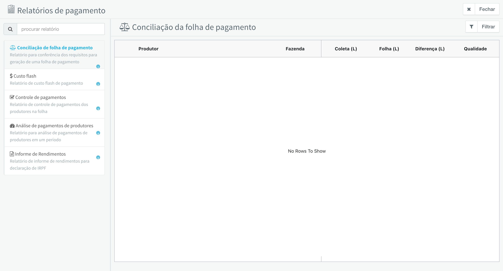

# Relatórios e Conciliações

O módulo de Relatórios e Conciliações oferece diversas ferramentas para análise, controle e conciliação dos dados relacionados às folhas de pagamento. Através de um menu lateral, é possível acessar 5 tipos diferentes de relatórios, cada um com funcionalidades específicas para diferentes necessidades de análise e controle.

## Menu de Relatórios

O menu lateral permite selecionar entre os 5 relatórios disponíveis. Cada relatório possui uma descrição que indica sua finalidade principal.

<figure>
  
  <figcaption>Menu lateral de seleção de relatórios de pagamento</figcaption>
</figure>

A imagem acima mostra o menu lateral com os 5 relatórios disponíveis, cada um identificado por um badge numerado:

**1. Conciliação de folha de pagamento**

Relatório para conferência dos requisitos para geração de uma folha de pagamento. Permite verificar se todos os requisitos necessários estão atendidos antes de gerar uma folha de pagamento, identificando possíveis inconsistências ou pendências.

**2. Custo flash**

Relatório de custo flash de pagamento. Permite visualizar e comparar os custos flash de pagamento entre diferentes folhas, útil para análise de variações de custos e tomada de decisões estratégicas.

**3. Controle de pagamentos**

Relatório de controle de pagamentos dos produtores na folha. Fornece uma visão consolidada dos pagamentos realizados, permitindo identificar pendências, valores pagos e status de cada pagamento.

**4. Análise de pagamentos de produtores**

Relatório para análise de pagamentos de produtores em um período. Permite analisar o histórico de pagamentos de produtores ao longo do tempo, identificando tendências e padrões.

**5. Informe de Rendimentos**

Relatório de informe de rendimentos para declaração de IRPF. Gera os dados necessários para a declaração de Imposto de Renda Pessoa Física dos produtores, incluindo valores pagos e retenções realizadas.

---

## Conciliação de Folha de Pagamento

O relatório de **Conciliação de Folha de Pagamento** é utilizado para verificar se todos os requisitos necessários estão atendidos antes de gerar uma folha de pagamento. Este relatório permite identificar possíveis inconsistências ou pendências que impediriam o processamento correto da folha.

### Quando usar

- Antes de gerar uma nova folha de pagamento
- Para verificar se todos os produtores possuem os requisitos necessários
- Para identificar inconsistências entre os volumes coletados e os volumes na folha
- Para validar a existência de contratos, qualidade e vigências

### Filtros disponíveis

- **Folha de referência**: Seleciona a folha que será utilizada como base para a conciliação

### Informações exibidas

O relatório exibe uma tabela com as seguintes colunas:

- **Situação**: Indicador visual (✓ ou ✗) mostrando se o produtor está apto para a folha
- **Produtor**: Código e nome do produtor
- **Coleta (L)**: Volume total coletado no período
- **Folha (L)**: Volume registrado na folha de pagamento
- **Diferença (L)**: Diferença entre o volume coletado e o volume na folha
- **Qualidade**: Indica se há dados de qualidade disponíveis (SIM/NÃO)
- **Contrato**: Indica se o produtor possui contrato ativo (SIM/NÃO)
- **Vigência**: Indica se o contrato está dentro da vigência (SIM/NÃO)

**Colunas adicionais** (conforme configurações da conta):

- **Fazenda**: Exibida quando o pagamento é por fazenda
- **IEPR**: Exibida quando há bloqueio por IEPR inativo

### Como usar

1. Clique no item "Conciliação de folha de pagamento" no menu lateral (badge 1)
2. Clique no botão "Filtrar" para abrir o painel de filtros
3. Selecione a folha de referência desejada
4. Clique em "Aplicar filtro"
5. Analise os resultados na tabela
6. Use o botão "Exportar" para gerar um arquivo CSV com os dados

### Interpretação dos resultados

- **Situação ✓ (verde)**: Produtor está apto para a folha, todos os requisitos estão atendidos
- **Situação ✗ (vermelho)**: Produtor possui pendências que impedem a geração da folha
- **Diferença = 0**: Volumes estão consistentes entre coleta e folha
- **Diferença > 0**: Há divergência entre os volumes que precisa ser investigada

---

## Custo Flash

O relatório de **Custo Flash** permite visualizar e comparar os custos flash de pagamento entre diferentes folhas. Este relatório é útil para análise de variações de custos e para tomada de decisões estratégicas.

### Quando usar

- Para comparar custos flash entre diferentes folhas
- Para analisar variações de custos ao longo do tempo
- Para verificar o impacto de diferentes configurações de custo flash
- Para planejamento financeiro e orçamentário

### Filtros disponíveis

- **Folha aberta**: Seleciona a folha que está sendo analisada
- **Folha de comparação**: Seleciona uma folha para comparação (opcional)
- **Linhas de captação**: Filtra por linha específica (opcional)
- **Exibir contratos**: 
  - Agrupados por contrato principal
  - Individuais por inscrição

### Informações exibidas

O relatório exibe uma tabela com informações detalhadas sobre os custos flash, incluindo:

- Dados de CEPEA (Centro de Estudos Avançados em Economia Aplicada)
- Percentuais de PIS/COFINS sobre frete
- Percentuais de ICMS sobre leite
- Percentuais de PIS/COFINS sobre leite
- Comparações entre folhas (quando aplicável)

**Resumo exibido no cabeçalho**:

- **CEPEA**: Valor do CEPEA em R$
- **P&C FRETE**: Percentual de PIS/COFINS sobre frete
- **ICMS LEITE**: Percentual de ICMS sobre leite
- **P&C LEITE**: Percentual de PIS/COFINS sobre leite

### Como usar

1. Clique no item "Custo flash" no menu lateral (badge 2)
2. Clique no botão "Filtrar" para abrir o painel de filtros
3. Selecione a folha aberta (obrigatório)
4. Opcionalmente, selecione uma folha de comparação
5. Opcionalmente, selecione uma linha de captação
6. Escolha como exibir os contratos (agrupados ou individuais)
7. Clique em "Aplicar filtro"
8. Analise os resultados na tabela
9. Use o botão "Exportar" para gerar um arquivo Excel com os dados

---

## Controle de Pagamentos

O relatório de **Controle de Pagamentos** permite acompanhar e controlar os pagamentos realizados aos produtores em uma folha específica. Este relatório é essencial para gestão financeira e controle de pagamentos.

### Quando usar

- Para acompanhar o status de pagamentos de uma folha
- Para marcar pagamentos como quitados
- Para verificar dados bancários dos produtores
- Para gerar relatórios de controle financeiro
- Para identificar pagamentos pendentes

### Filtros disponíveis

- **Folha de pagamento**: Seleciona a folha que será analisada (obrigatório)
- **Banco**: Filtra por banco específico (opcional)
- **Produtor**: Busca por nome do produtor (opcional)
- **Situação cadastral Inscrição estadual**:
  - Qualquer situação cadastral
  - Apenas com inscrição informada
  - Apenas sem inscrição estadual
- **Situação do pagamento**:
  - Todos os pagamentos
  - Apenas os quitados
  - Apenas os pendentes

### Informações exibidas

O relatório exibe uma tabela agrupada por banco, contendo:

**Por banco**:
- Nome do banco
- Total do banco em R$

**Por produtor**:
- **PRODUTOR**: Nome, código, documento (CPF/CNPJ) e inscrição estadual (se houver)
- **BENEFICIÁRIO**: Nome e CPF do beneficiário (se diferente do produtor) ou "PRÓPRIO"
- **DADOS BANCÁRIOS**: Agência e conta (clicáveis para copiar)
- **VALOR (R$)**: Valor total do pagamento
- **PAGO**: Switch para marcar/desmarcar o pagamento como quitado

### Como usar

1. Clique no item "Controle de pagamentos" no menu lateral (badge 3)
2. Clique no botão "Filtrar" para abrir o painel de filtros
3. Selecione a folha de pagamento (obrigatório)
4. Aplique filtros adicionais conforme necessário
5. Clique em "Aplicar filtro"
6. Analise os resultados agrupados por banco
7. Use o switch na coluna "PAGO" para marcar pagamentos como quitados
8. Use o botão "Exportar" para gerar um arquivo com os dados

### Funcionalidades especiais

- **Marcar como pago**: Ao ativar o switch "PAGO", o sistema registra a data de pagamento automaticamente
- **Copiar dados**: Clique em qualquer dado bancário, CPF, CNPJ ou valor para copiar para a área de transferência
- **Agrupamento por banco**: Os pagamentos são organizados por banco para facilitar a gestão

---

## Análise de Pagamentos de Produtores

O relatório de **Análise de Pagamentos de Produtores** permite analisar tendências e padrões de pagamento aos produtores em um período específico. Este relatório é útil para análises estratégicas e tomada de decisões.

### Quando usar

- Para analisar padrões de pagamento em um período
- Para identificar tendências de valores pagos
- Para comparar pagamentos entre diferentes modelos
- Para análises estatísticas e relatórios gerenciais
- Para sincronizar dados com dashboards

### Filtros disponíveis

- **Folha de corte**: Seleciona a folha que será analisada (obrigatório)

### Informações exibidas

O relatório exibe uma tabela com informações detalhadas sobre os pagamentos, incluindo:

- **Modelo**: Modelo de pagamento aplicado
- Dados do produtor (código, nome)
- Volumes e valores
- Composição do pagamento
- Comparações e análises estatísticas

### Como usar

1. Clique no item "Análise de pagamentos de produtores" no menu lateral (badge 4)
2. Clique no botão "Filtrar" para abrir o painel de filtros
3. Selecione a folha de corte desejada
4. Clique em "Aplicar filtro"
5. Analise os resultados na tabela
6. Use o menu "Exportar" para:
   - Gerar relatório em planilha (Excel)
   - Sincronizar com dashboard

### Funcionalidades especiais

- **Sincronização com dashboard**: Permite enviar os dados do relatório para o dashboard do sistema para visualizações mais avançadas
- **Exportação em planilha**: Gera arquivo Excel com todos os dados do relatório para análises externas

---

## Informe de Rendimentos

O relatório de **Informe de Rendimentos** é utilizado para gerar documentos necessários para a declaração de imposto de renda dos produtores. Este relatório gera os informes de rendimentos (IRPF) conforme a legislação vigente.

### Quando usar

- Para gerar informes de rendimentos para declaração de IRPF
- Para atender obrigações fiscais relacionadas a pagamentos a produtores rurais
- Para fornecer documentação fiscal aos produtores
- Para gerar informes em lote ou individuais

### Filtros disponíveis

- **Ano-Calendário**: Seleciona o ano para o qual o informe será gerado (obrigatório)
- **Linha**: Filtra por linha de captação específica (opcional)
- **Produtor**: Seleciona um produtor específico (opcional)
- **Proprietário do Tanque**: Seleciona um proprietário de tanque específico (opcional)

### Informações exibidas

O relatório exibe uma tabela com as seguintes informações:

- **PRODUTOR**: Nome e código do produtor
- **CPF**: CPF do produtor (clicável para copiar)
- **VALOR BRUTO (R$)**: Valor total bruto recebido no período
- **TOTAL IMPOSTOS (R$)**: Total de impostos descontados
- **VALOR LÍQUIDO (R$)**: Valor líquido recebido após descontos
- **AÇÕES**: Botão para gerar informe individual em PDF

### Como usar

1. Clique no item "Informe de Rendimentos" no menu lateral (badge 5)
2. Clique no botão "Filtrar" para abrir o painel de filtros
3. Selecione o ano-calendário (obrigatório)
4. Aplique filtros adicionais conforme necessário
5. Clique em "Aplicar filtro"
6. Analise os resultados na tabela
7. Para gerar informes:
   - **Individual**: Clique no botão com ícone de PDF na coluna "AÇÕES" de cada produtor
   - **Em lote**: Clique no botão "Gerar Informe em Lote" no cabeçalho

### Funcionalidades especiais

- **Geração individual**: Gera PDF do informe de rendimentos para um produtor específico
- **Geração em lote**: Gera PDFs de todos os produtores filtrados em um único processo
- **Cópia de dados**: Clique no CPF para copiar para a área de transferência

### Observações importantes

- O informe de rendimentos é gerado conforme a legislação fiscal vigente
- Os valores são calculados com base nos pagamentos efetivamente realizados no período
- O informe individual pode ser enviado diretamente ao produtor
- O informe em lote é útil para processamento interno e arquivamento

---
