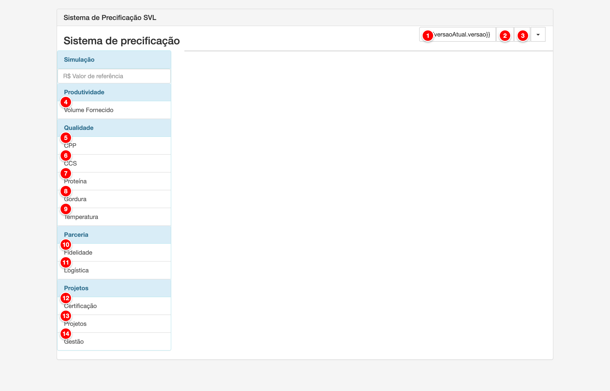

# Sistema de Precificação (SVL)

O Sistema de Precificação (SVL) define as faixas de bonificação e penalização aplicadas ao pagamento dos produtores baseadas em indicadores de qualidade, produtividade, parceria e projetos. Cada versão do SVL possui configurações específicas de faixas e valores de bonificação/penalização que são aplicadas durante o cálculo da folha de pagamento.

<figure>
  
  <figcaption>Tela do Sistema de Precificação SVL do módulo Pay</figcaption>
</figure>

> **Nota**: Tela principal do Sistema de Precificação SVL com as seções principais numeradas para referência.

## Descrição dos Elementos

Seguindo a numeração presente na imagem acima:

**1. Versão do SVL**

Botão que exibe a versão atual do SVL e permite editar suas configurações.

**Como ajustar:**
- Acesse o menu Pagamento > Sistema de Precificação
- Clique no botão que exibe a versão atual (exemplo: "Versão 3.0")
- Na modal que abre, ajuste os seguintes campos:
  - **Código**: Código de identificação da versão (opcional)
  - **Versão**: Nome da versão (exemplo: "Versão 3.0")
  - **Tipo de bonificação**: Selecione entre "Preço por litro" ou "Porcentagem sobre tabela de preço"
  - **Precisão do bônus**: Número de casas decimais para exibição dos valores (padrão: 3)
  - **Tabela de preço**: Se "Porcentagem sobre tabela de preço" for selecionado, escolha a tabela de referência
- Clique em "Salvar" para aplicar as alterações

**Para que serve:**
A versão do SVL permite organizar e versionar as configurações de bonificação e penalização. Isso é essencial para manter histórico de alterações e aplicar diferentes políticas de pagamento em períodos distintos. Cada versão possui suas próprias faixas de bonificação/penalização para os diferentes indicadores.

**Como afeta o cálculo:**
A versão do SVL selecionada no contrato determina quais faixas e valores de bonificação serão aplicados no cálculo da folha de pagamento. Durante o cálculo, o sistema consulta as regras configuradas na versão ativa para cada indicador (qualidade, produtividade, parceria, projetos) e aplica os valores correspondentes conforme os resultados do produtor.

---

**2. Clonar Versão**

Botão que permite criar uma nova versão do SVL baseada na versão atual, copiando todas as configurações existentes.

**Como ajustar:**
- Acesse o menu Pagamento > Sistema de Precificação
- Certifique-se de que há uma versão do SVL ativa
- Clique no botão "Clonar Versão" (ícone de clone) ao lado do botão de versão
- Na modal que abre, informe:
  - **Código**: Código da nova versão (opcional)
  - **Versão**: Nome da nova versão (exemplo: "Versão 4.0")
- Clique em "Salvar" para criar a nova versão

**Para que serve:**
A função de clonar versão facilita a criação de novas versões baseadas em versões existentes, evitando a necessidade de reconfigurar todas as faixas e regras manualmente. É útil quando é necessário fazer pequenos ajustes nas faixas de bonificação mantendo a estrutura base.

**Como afeta o cálculo:**
A nova versão criada terá todas as configurações da versão original. Após a criação, você pode editar as faixas e valores conforme necessário. A nova versão não afeta os cálculos até que seja selecionada em um contrato ou marcada como versão padrão.

---

**3. Remover Versão**

Botão que permite excluir a versão atual do SVL.

**Como ajustar:**
- Acesse o menu Pagamento > Sistema de Precificação
- Certifique-se de que está visualizando a versão que deseja remover
- Clique no botão "Remover Versão" (ícone de lixeira) ao lado do botão de versão
- Confirme a exclusão quando solicitado

**Para que serve:**
A função de remover versão permite excluir versões do SVL que não são mais necessárias, mantendo o sistema organizado e evitando confusão com versões antigas ou obsoletas.

**Como afeta o cálculo:**
A versão removida não poderá mais ser utilizada em contratos. Se houver contratos utilizando esta versão, será necessário atualizá-los para usar outra versão antes de remover a versão atual.

---

**4. Volume Fornecido**

Link de navegação que abre a seção de configuração de faixas de bonificação por volume diário fornecido.

**Como ajustar:**
- Acesse o menu Pagamento > Sistema de Precificação
- No menu lateral, clique em "Volume Fornecido" na seção "Produtividade"
- Na tela que abre, clique em "Nova regra" para criar uma nova faixa
- Configure:
  - **Código**: Código de identificação da regra
  - **Volume mínimo**: Volume mínimo diário para a faixa (em litros)
  - **Volume máximo**: Volume máximo diário para a faixa (em litros)
  - **Bônus por litro**: Valor de bonificação (em R$/L ou % conforme o tipo configurado na versão)
- Clique em "Salvar" para aplicar

**Para que serve:**
A seção de Volume Fornecido permite configurar faixas de bonificação baseadas no volume médio diário fornecido pelo produtor. Produtores que fornecem volumes maiores podem receber bonificações adicionais.

**Como afeta o cálculo:**
Durante o cálculo da folha, o sistema verifica o volume médio diário fornecido pelo produtor no período e aplica a bonificação correspondente à faixa em que o produtor se enquadra. Quanto maior o volume fornecido, maior pode ser a bonificação aplicada.

---

**5. CPP**

Link de navegação que abre a seção de configuração de faixas de bonificação e penalização por Contagem de Placas (CPP).

**Como ajustar:**
- Acesse o menu Pagamento > Sistema de Precificação
- No menu lateral, clique em "CPP" na seção "Qualidade"
- Na tela que abre, clique em "Nova regra" para criar uma nova faixa
- Configure:
  - **Código**: Código de identificação da regra
  - **Valor mínimo**: Valor mínimo de CPP para a faixa
  - **Valor máximo**: Valor máximo de CPP para a faixa
  - **Cor**: Cor de identificação visual da faixa
  - **Bônus por litro**: Valor de bonificação ou penalização (em R$/L ou % conforme o tipo configurado)
- Clique em "Salvar" para aplicar

**Para que serve:**
A seção de CPP permite configurar faixas de bonificação e penalização baseadas na contagem de placas do leite. Valores menores de CPP (melhor qualidade) podem receber bonificações, enquanto valores maiores podem receber penalizações.

**Como afeta o cálculo:**
Durante o cálculo da folha, o sistema consulta o resultado de CPP das análises de qualidade do leite do produtor e aplica a bonificação ou penalização correspondente à faixa configurada. Valores de CPP menores (melhor qualidade) resultam em bonificações maiores.

---

**6. CCS**

Link de navegação que abre a seção de configuração de faixas de bonificação e penalização por Contagem de Células Somáticas (CCS).

**Como ajustar:**
- Acesse o menu Pagamento > Sistema de Precificação
- No menu lateral, clique em "CCS" na seção "Qualidade"
- Na tela que abre, clique em "Nova regra" para criar uma nova faixa
- Configure:
  - **Código**: Código de identificação da regra
  - **Valor mínimo**: Valor mínimo de CCS para a faixa
  - **Valor máximo**: Valor máximo de CCS para a faixa
  - **Cor**: Cor de identificação visual da faixa
  - **Bônus por litro**: Valor de bonificação ou penalização (em R$/L ou % conforme o tipo configurado)
- Clique em "Salvar" para aplicar

**Para que serve:**
A seção de CCS permite configurar faixas de bonificação e penalização baseadas na contagem de células somáticas do leite. Valores menores de CCS (melhor qualidade) podem receber bonificações, enquanto valores maiores podem receber penalizações.

**Como afeta o cálculo:**
Durante o cálculo da folha, o sistema consulta o resultado de CCS das análises de qualidade do leite do produtor e aplica a bonificação ou penalização correspondente à faixa configurada. Valores de CCS menores (melhor qualidade) resultam em bonificações maiores.

---

**7. Proteína**

Link de navegação que abre a seção de configuração de faixas de bonificação e penalização por teor de proteína.

**Como ajustar:**
- Acesse o menu Pagamento > Sistema de Precificação
- No menu lateral, clique em "Proteína" na seção "Qualidade"
- Na tela que abre, clique em "Nova regra" para criar uma nova faixa
- Configure:
  - **Código**: Código de identificação da regra
  - **Valor mínimo**: Valor mínimo de proteína para a faixa
  - **Valor máximo**: Valor máximo de proteína para a faixa
  - **Cor**: Cor de identificação visual da faixa
  - **Bônus por litro**: Valor de bonificação ou penalização (em R$/L ou % conforme o tipo configurado)
- Clique em "Salvar" para aplicar

**Para que serve:**
A seção de Proteína permite configurar faixas de bonificação e penalização baseadas no teor de proteína do leite. Valores maiores de proteína podem receber bonificações, enquanto valores menores podem receber penalizações.

**Como afeta o cálculo:**
Durante o cálculo da folha, o sistema consulta o resultado de proteína das análises de qualidade do leite do produtor e aplica a bonificação ou penalização correspondente à faixa configurada. Valores de proteína maiores resultam em bonificações maiores.

---

**8. Gordura**

Link de navegação que abre a seção de configuração de faixas de bonificação e penalização por teor de gordura.

**Como ajustar:**
- Acesse o menu Pagamento > Sistema de Precificação
- No menu lateral, clique em "Gordura" na seção "Qualidade"
- Na tela que abre, clique em "Nova regra" para criar uma nova faixa
- Configure:
  - **Código**: Código de identificação da regra
  - **Valor mínimo**: Valor mínimo de gordura para a faixa
  - **Valor máximo**: Valor máximo de gordura para a faixa
  - **Cor**: Cor de identificação visual da faixa
  - **Bônus por litro**: Valor de bonificação ou penalização (em R$/L ou % conforme o tipo configurado)
- Clique em "Salvar" para aplicar

**Para que serve:**
A seção de Gordura permite configurar faixas de bonificação e penalização baseadas no teor de gordura do leite. Valores maiores de gordura podem receber bonificações, enquanto valores menores podem receber penalizações.

**Como afeta o cálculo:**
Durante o cálculo da folha, o sistema consulta o resultado de gordura das análises de qualidade do leite do produtor e aplica a bonificação ou penalização correspondente à faixa configurada. Valores de gordura maiores resultam em bonificações maiores.

---

**9. Temperatura**

Link de navegação que abre a seção de configuração de faixas de bonificação e penalização por temperatura de recebimento.

**Como ajustar:**
- Acesse o menu Pagamento > Sistema de Precificação
- No menu lateral, clique em "Temperatura" na seção "Qualidade"
- Na tela que abre, clique em "Nova regra" para criar uma nova faixa
- Configure:
  - **Código**: Código de identificação da regra
  - **Valor mínimo**: Temperatura mínima para a faixa (em graus Celsius)
  - **Valor máximo**: Temperatura máxima para a faixa (em graus Celsius)
  - **Cor**: Cor de identificação visual da faixa
  - **Bônus por litro**: Valor de bonificação ou penalização (em R$/L ou % conforme o tipo configurado)
- Clique em "Salvar" para aplicar

**Para que serve:**
A seção de Temperatura permite configurar faixas de bonificação e penalização baseadas na temperatura de recebimento do leite. Temperaturas adequadas (geralmente entre 2°C e 8°C) podem receber bonificações, enquanto temperaturas fora da faixa ideal podem receber penalizações.

**Como afeta o cálculo:**
Durante o cálculo da folha, o sistema consulta a temperatura de recebimento do leite e aplica a bonificação ou penalização correspondente à faixa configurada. Temperaturas dentro da faixa ideal resultam em bonificações, enquanto temperaturas fora da faixa podem resultar em penalizações.

---

**10. Fidelidade**

Link de navegação que abre a seção de configuração de bonificações por tempo de parceria (fidelidade).

**Como ajustar:**
- Acesse o menu Pagamento > Sistema de Precificação
- No menu lateral, clique em "Fidelidade" na seção "Parceria"
- Na tela que abre, clique em "Nova regra" para criar uma nova faixa
- Configure:
  - **Código**: Código de identificação da regra
  - **Mês inicial**: Mês inicial da faixa de tempo de parceria
  - **Mês final**: Mês final da faixa de tempo de parceria
  - **Bônus por litro**: Valor de bonificação (em R$/L ou % conforme o tipo configurado)
- Clique em "Salvar" para aplicar

**Para que serve:**
A seção de Fidelidade permite configurar bonificações baseadas no tempo de parceria entre o produtor e a empresa. Produtores com maior tempo de parceria podem receber bonificações maiores como forma de reconhecimento pela fidelidade.

**Como afeta o cálculo:**
Durante o cálculo da folha, o sistema verifica o tempo de parceria do produtor (em meses) e aplica a bonificação correspondente à faixa configurada. Quanto maior o tempo de parceria, maior pode ser a bonificação aplicada.

---

**11. Logística**

Link de navegação que abre a seção de configuração de bonificações por logística e transporte.

**Como ajustar:**
- Acesse o menu Pagamento > Sistema de Precificação
- No menu lateral, clique em "Logística" na seção "Parceria"
- Na tela que abre, clique em "Nova regra" para criar uma nova configuração
- Configure os parâmetros de logística conforme necessário
- Clique em "Salvar" para aplicar

**Para que serve:**
A seção de Logística permite configurar bonificações baseadas em configurações de logística e transporte, como distância, tipo de transporte ou outras condições logísticas específicas.

**Como afeta o cálculo:**
Durante o cálculo da folha, o sistema verifica as configurações de logística do produtor e aplica as bonificações correspondentes conforme as regras configuradas.

---

**12. Certificação**

Link de navegação que abre a seção de configuração de bonificações por certificações.

**Como ajustar:**
- Acesse o menu Pagamento > Sistema de Precificação
- No menu lateral, clique em "Certificação" na seção "Projetos"
- Na tela que abre, clique em "Nova regra" para criar uma nova configuração
- Configure:
  - **Certificação**: Selecione a certificação
  - **Bônus por litro**: Valor de bonificação (em R$/L ou % conforme o tipo configurado)
- Clique em "Salvar" para aplicar

**Para que serve:**
A seção de Certificação permite configurar bonificações para produtores que possuem certificações específicas, incentivando práticas de produção certificadas e de qualidade.

**Como afeta o cálculo:**
Durante o cálculo da folha, o sistema verifica se o produtor possui certificações vinculadas e aplica as bonificações correspondentes conforme as regras configuradas.

---

**13. Projetos**

Link de navegação que abre a seção de configuração de bonificações por participação em projetos e programas.

**Como ajustar:**
- Acesse o menu Pagamento > Sistema de Precificação
- No menu lateral, clique em "Projetos" na seção "Projetos"
- Na tela que abre, clique em "Nova regra" para criar uma nova configuração
- Configure:
  - **Projeto**: Selecione o projeto ou programa
  - **Bônus por litro**: Valor de bonificação (em R$/L ou % conforme o tipo configurado)
- Clique em "Salvar" para aplicar

**Para que serve:**
A seção de Projetos permite configurar bonificações para produtores que participam de projetos e programas de melhoria, incentivando a participação em iniciativas de desenvolvimento e qualidade.

**Como afeta o cálculo:**
Durante o cálculo da folha, o sistema verifica se o produtor está vinculado a projetos ou programas e aplica as bonificações correspondentes conforme as regras configuradas.

---

**14. Gestão**

Link de navegação que abre a seção de configuração de bonificações por gestão de tanque ou cooperativa.

**Como ajustar:**
- Acesse o menu Pagamento > Sistema de Precificação
- No menu lateral, clique em "Gestão" na seção "Projetos"
- Na tela que abre, clique em "Nova regra" para criar uma nova configuração
- Configure:
  - **Volume mínimo**: Volume mínimo para a faixa
  - **Volume máximo**: Volume máximo para a faixa
  - **Bônus por litro**: Valor de bonificação (em R$/L ou % conforme o tipo configurado)
- Clique em "Salvar" para aplicar

**Para que serve:**
A seção de Gestão permite configurar bonificações baseadas em gestão de tanque ou cooperativa, incentivando práticas de gestão coletiva e organizada.

**Como afeta o cálculo:**
Durante o cálculo da folha, o sistema verifica as configurações de gestão do produtor (tanque ou cooperativa) e aplica as bonificações correspondentes conforme as regras configuradas.

---

## Seções de Configuração

O Sistema de Precificação SVL é organizado em seções que permitem configurar diferentes tipos de bonificação e penalização:

### Produtividade

Configura faixas de bonificação baseadas no volume diário fornecido pelo produtor.

- **Volume Fornecido**: Define faixas de volume mínimo e máximo com valores de bonificação correspondentes (em R$/L ou % conforme o tipo de bonificação configurado na versão)

**Como afeta o cálculo:**
Durante o cálculo da folha, o sistema verifica o volume médio diário fornecido pelo produtor e aplica a bonificação correspondente à faixa em que o produtor se enquadra.

### Qualidade

Configura faixas de bonificação e penalização baseadas nos indicadores de qualidade do leite.

- **CPP** (Contagem de Placas): Faixas de bonificação/penalização baseadas na contagem de células somáticas
- **CCS** (Contagem de Células Somáticas): Faixas de bonificação/penalização baseadas na contagem de células somáticas
- **Proteína**: Faixas de bonificação/penalização baseadas no teor de proteína
- **Gordura**: Faixas de bonificação/penalização baseadas no teor de gordura
- **Temperatura**: Faixas de bonificação/penalização baseadas na temperatura de recebimento

**Como afeta o cálculo:**
Durante o cálculo da folha, o sistema consulta os resultados das análises de qualidade do leite do produtor e aplica as bonificações ou penalizações correspondentes às faixas configuradas para cada indicador.

### Parceria

Configura bonificações baseadas em parcerias e relacionamentos comerciais.

- **Fidelidade**: Bonificações baseadas no tempo de parceria (em meses)
- **Logística**: Bonificações baseadas em configurações de logística e transporte

**Como afeta o cálculo:**
Durante o cálculo da folha, o sistema verifica o tempo de parceria e as configurações de logística do produtor e aplica as bonificações correspondentes.

### Projetos

Configura bonificações baseadas em projetos e programas de melhoria.

- **Certificação**: Bonificações para produtores com certificações específicas
- **Projetos**: Bonificações para produtores participantes de programas e projetos
- **Gestão**: Bonificações baseadas em gestão de tanque ou cooperativa

**Como afeta o cálculo:**
Durante o cálculo da folha, o sistema verifica se o produtor está vinculado a certificações, projetos ou configurações de gestão e aplica as bonificações correspondentes.

---

## Tipo de Bonificação

O sistema permite configurar dois tipos de bonificação na versão do SVL:

### Preço por Litro (V)

Os valores de bonificação são definidos diretamente em reais por litro (R$/L). Exemplo: R$ 0,030 por litro fornecido.

### Porcentagem sobre Tabela de Preço (P)

Os valores de bonificação são definidos como porcentagem sobre uma tabela de preço de referência. Neste modo, é necessário:
- Selecionar uma tabela de preço de referência
- Definir um valor de referência para simulação
- Os valores de bonificação são calculados como porcentagem deste valor de referência

---

## Campos Condicionais

### Simulação (Campo de Valor de Referência)

Este campo aparece apenas quando o tipo de bonificação configurado na versão é "Porcentagem sobre tabela de preço".

**Como ajustar:**
- Certifique-se de que a versão do SVL está configurada com tipo "Porcentagem sobre tabela de preço"
- O campo "R$ Valor de referência" aparecerá na seção "Simulação" do menu lateral
- Digite o valor de referência desejado para simulação
- Este valor é usado para calcular e visualizar os valores de bonificação em R$/L durante a configuração

**Para que serve:**
O campo de simulação permite visualizar os valores de bonificação em reais por litro quando se utiliza porcentagem sobre tabela de preço, facilitando a configuração e verificação das faixas de bonificação.

**Como afeta o cálculo:**
O valor inserido neste campo não afeta diretamente os cálculos da folha. Ele é usado apenas para simulação e visualização durante a configuração. Nos cálculos reais, o sistema utiliza o preço da tabela de preço de referência configurada na versão do SVL.
