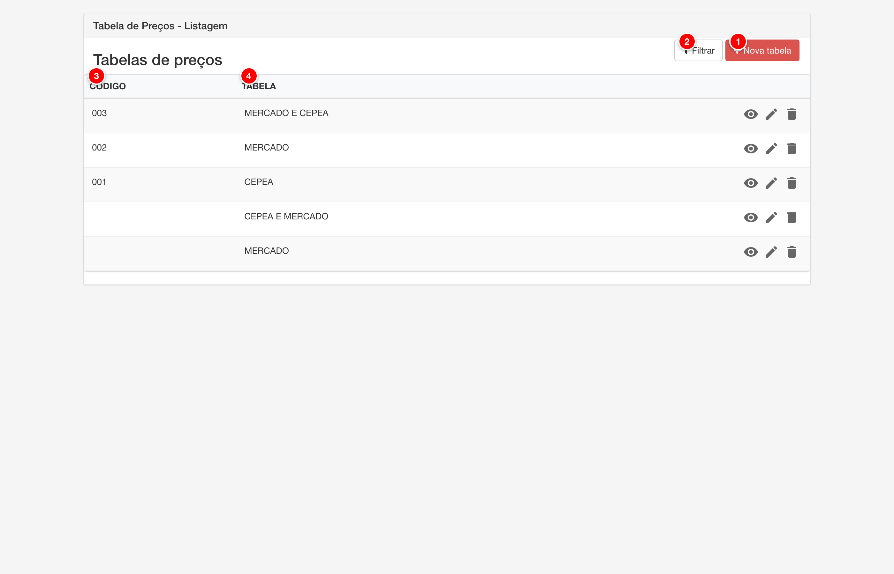
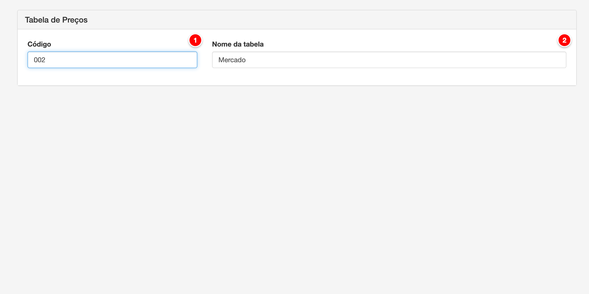
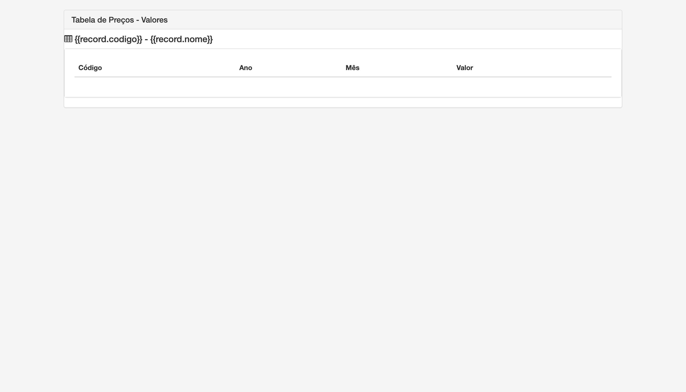
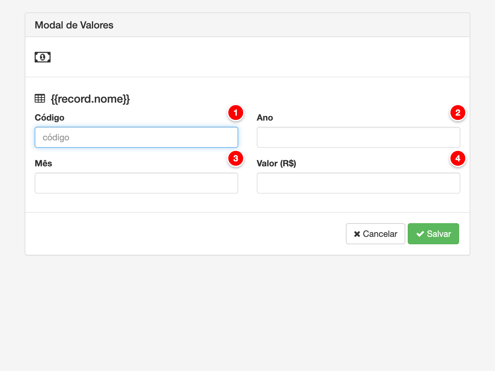

# Tabela de preços

As tabelas de preços são configurações que armazenam valores mensais utilizados como ponto de partida para composição da precificação do leite. Cada tabela pode conter múltiplos valores mensais, permitindo histórico e referência para diferentes períodos. As tabelas de preço são utilizadas nos modelos de pagamento como elementos de referência para cálculo do valor a ser pago aos produtores.

<figure>
  
  <figcaption>Tela de listagem de tabelas de preços do módulo Pay</figcaption>
</figure>

> **Nota**: Tela de listagem de tabelas de preços com os elementos principais numerados para referência.

## Descrição dos Elementos da Listagem

Seguindo a numeração presente na imagem acima:

**1. Nova tabela**

Botão que abre o formulário para criar uma nova tabela de preços.

**Como ajustar:**
- Acesse o menu Pagamento > Tabela de Preços
- Clique no botão "Nova tabela" no canto superior direito
- O formulário de criação será aberto
- Preencha os campos (Código e Nome da tabela) e clique em "Salvar"

**Para que serve:**
Permite criar novas tabelas de preços no sistema. Cada tabela pode ser utilizada em diferentes modelos de pagamento como referência de preço.

**Como afeta o cálculo:**
As novas tabelas criadas ficam disponíveis para seleção nos modelos de pagamento. Quando uma tabela é selecionada em um modelo, seus valores mensais são utilizados como referência para o cálculo do pagamento aos produtores.

---

**2. Filtrar**

Botão que abre o painel de filtros para buscar tabelas de preços específicas.

**Como ajustar:**
- Na tela de listagem, clique no botão "Filtrar"
- O painel de filtros será aberto
- Selecione os critérios de busca desejados (código, nome, etc.)
- Clique em "Aplicar" para filtrar os resultados

**Para que serve:**
Permite buscar e filtrar tabelas de preços cadastradas, facilitando a localização de tabelas específicas quando há muitas tabelas cadastradas no sistema.

**Como afeta o cálculo:**
O filtro não afeta os cálculos da folha de pagamento, apenas facilita a navegação e localização de tabelas na interface administrativa.

---

**3. Código (coluna ordenável)**

Cabeçalho da coluna que exibe o código das tabelas de preços. Permite ordenar a listagem por código.

**Como ajustar:**
- Na tabela de listagem, clique no cabeçalho "CÓDIGO"
- A listagem será ordenada por código (crescente ou decrescente)
- Clique novamente para inverter a ordem

**Para que serve:**
Exibe o código identificador de cada tabela de preços e permite ordenar a listagem por este critério, facilitando a localização de tabelas específicas.

**Como afeta o cálculo:**
A ordenação não afeta os cálculos da folha de pagamento, apenas a apresentação visual da listagem.

---

**4. Tabela (coluna ordenável)**

Cabeçalho da coluna que exibe o nome das tabelas de preços. Permite ordenar a listagem por nome.

**Como ajustar:**
- Na tabela de listagem, clique no cabeçalho "TABELA"
- A listagem será ordenada por nome (crescente ou decrescente)
- Clique novamente para inverter a ordem

**Para que serve:**
Exibe o nome descritivo de cada tabela de preços e permite ordenar a listagem por este critério, facilitando a localização visual de tabelas.

**Como afeta o cálculo:**
A ordenação não afeta os cálculos da folha de pagamento, apenas a apresentação visual da listagem.

---

**5. Visualizar**

Ícone de olho que permite visualizar os detalhes de uma tabela de preços sem permitir edição.

**Como ajustar:**
- Na listagem, localize a tabela que deseja visualizar
- Clique no ícone de visualização (👁️) na linha da tabela
- A tela de visualização será aberta mostrando os dados da tabela e seus valores mensais

**Para que serve:**
Permite visualizar os detalhes completos de uma tabela de preços, incluindo código, nome e valores mensais cadastrados, sem permitir edição. Útil para consulta e verificação de dados.

**Como afeta o cálculo:**
A visualização não afeta os cálculos da folha de pagamento, apenas permite consultar as informações da tabela.

---

**6. Editar**

Ícone de lápis que permite editar uma tabela de preços existente.

**Como ajustar:**
- Na listagem, localize a tabela que deseja editar
- Clique no ícone de edição (✏️) na linha da tabela
- A tela de edição será aberta com os dados da tabela preenchidos
- Modifique os campos desejados (Código, Nome da tabela) ou valores mensais
- Clique em "Salvar" para confirmar as alterações

**Para que serve:**
Permite modificar tabelas de preços já cadastradas, ajustando código, nome ou valores mensais conforme necessário. Isso é útil quando há correções ou atualizações de dados.

**Como afeta o cálculo:**
As alterações nas tabelas afetam imediatamente os cálculos da folha de pagamento. Quando uma tabela é editada (especialmente seus valores mensais), o sistema passa a usar os novos valores para os cálculos que referenciam aquela tabela. Isso pode impactar folhas já geradas se os valores forem alterados retroativamente.

---

**7. Excluir**

Ícone de lixeira que permite excluir uma tabela de preços.

**Como ajustar:**
- Na listagem, localize a tabela que deseja excluir
- Clique no ícone de exclusão (🗑️) na linha da tabela
- Confirme a exclusão quando solicitado
- A tabela será removida permanentemente do sistema

**Para que serve:**
Permite remover tabelas de preços que não são mais necessárias ou que foram cadastradas incorretamente. A exclusão é permanente e não pode ser desfeita.

**Como afeta o cálculo:**
Quando uma tabela é excluída, o sistema deixa de ter referência para aquela tabela. Se um modelo de pagamento estiver utilizando a tabela excluída, o sistema pode resultar em erro ou valor zero no cálculo. É importante verificar se a tabela não está sendo utilizada em modelos de pagamento antes de excluí-la.

---

## Formulário de Cadastro e Edição

A tela de cadastro e edição permite criar novas tabelas de preços ou modificar tabelas existentes.

<figure>
  
  <figcaption>Tela de cadastro e edição de tabela de preços do módulo Pay</figcaption>
</figure>

> **Nota**: Tela de cadastro e edição de tabela de preços com os campos principais numerados para referência.

### Descrição dos Elementos do Formulário

Seguindo a numeração presente na imagem acima:

**1. Código**

Campo de texto que identifica unicamente a tabela de preços dentro da conta.

**Como ajustar:**
- Acesse o menu Pagamento > Tabela de Preços
- Clique em "Nova tabela" ou edite uma tabela existente
- No campo "Código", digite um código único (máximo 15 caracteres)
- O código é opcional e pode ser deixado em branco

**Para que serve:**
O código serve como identificador opcional da tabela de preços, permitindo referenciar a tabela em modelos de pagamento e outros módulos do sistema. Facilita a organização e busca de tabelas quando há múltiplas tabelas cadastradas.

**Como afeta o cálculo:**
O código não afeta diretamente os cálculos da folha de pagamento, mas é essencial para identificar qual tabela será utilizada nos modelos de pagamento. A tabela selecionada no modelo de pagamento determina quais valores mensais serão utilizados como referência para o cálculo do pagamento.

---

**2. Nome da tabela**

Campo de texto obrigatório que define o nome descritivo da tabela de preços.

**Como ajustar:**
- Acesse o menu Pagamento > Tabela de Preços
- Clique em "Nova tabela" ou edite uma tabela existente
- No campo "Nome da tabela", digite o nome descritivo (máximo 255 caracteres)
- O campo é obrigatório e deve ser preenchido antes de salvar
- Exemplos: "CEPEA - Leite Cru Refrigerado", "Tabela Regional", "Preço Base"

**Para que serve:**
O nome da tabela permite identificar facilmente o tipo de tabela de preço e sua finalidade. Facilita a seleção da tabela correta ao configurar modelos de pagamento e ajuda na organização dos diferentes índices de preço disponíveis.

**Como afeta o cálculo:**
O nome não afeta os cálculos, mas é importante para identificar qual tabela está sendo utilizada. Cada tabela possui valores mensais que são consultados durante o cálculo da folha de pagamento conforme o período de referência e a configuração do modelo de pagamento (mês atual ou mês anterior).

---

## Aba Valores

A aba "Valores" permite gerenciar os valores mensais da tabela de preços. Esta aba está disponível apenas quando a tabela já foi criada (não está disponível no modo de criação).

<figure>
  
  <figcaption>Tela de valores da tabela de preços</figcaption>
</figure>

> **Nota**: Tela de gestão de valores mensais da tabela de preços com os elementos principais numerados para referência.

### Descrição dos Elementos da Aba Valores

**1. Incluir valor**

Botão que abre o modal para adicionar um novo valor mensal à tabela de preços.

**Como ajustar:**
- Acesse o menu Pagamento > Tabela de Preços
- Edite uma tabela existente
- Clique na aba "Valores"
- Clique no botão "Incluir valor"
- Preencha os campos do modal:
  - **Código**: Código identificador do valor (opcional)
  - **Ano**: Ano de referência do valor
  - **Mês**: Mês de referência do valor (1 a 12)
  - **Valor**: Valor do preço para o mês (em reais)
- Clique em "Salvar" para confirmar

**Para que serve:**
Permite adicionar valores mensais à tabela de preços, criando um histórico de preços que pode ser consultado durante o cálculo da folha de pagamento. Cada valor representa o preço de referência para um mês específico.

**Como afeta o cálculo:**
Os valores mensais são consultados durante o cálculo da folha de pagamento conforme o modelo de pagamento configurado. Se o modelo utilizar "Mês atual", o sistema busca o valor do mês de referência da folha. Se utilizar "Mês anterior", busca o valor do mês anterior ao de referência. O valor encontrado é então utilizado na fórmula de cálculo do pagamento.

---

**2. Editar valor**

Ícone de lápis que permite editar um valor mensal existente.

**Como ajustar:**
- Na tabela de valores, localize o valor que deseja editar
- Clique no ícone de lápis (✏️) na linha do valor
- O modal de edição será aberto com os dados do valor preenchidos
- Modifique os campos desejados (Código, Ano, Mês, Valor)
- Clique em "Salvar" para confirmar as alterações

**Para que serve:**
Permite modificar valores mensais já cadastrados, ajustando preços conforme necessário. Isso é útil quando há correções de valores ou atualizações de preços retroativas.

**Como afeta o cálculo:**
As alterações nos valores afetam imediatamente os cálculos da folha de pagamento. Quando um valor é editado, o sistema passa a usar o novo valor para os cálculos que referenciam aquele mês específico. Isso pode impactar folhas já geradas se o valor for alterado retroativamente.

---

**3. Excluir valor**

Ícone de lixeira que permite excluir um valor mensal da tabela.

**Como ajustar:**
- Na tabela de valores, localize o valor que deseja excluir
- Clique no ícone de lixeira (🗑️) na linha do valor
- Confirme a exclusão quando solicitado
- O valor será removido permanentemente do sistema

**Para que serve:**
Permite remover valores mensais que não são mais necessários ou que foram cadastrados incorretamente. A exclusão é permanente e não pode ser desfeita.

**Como afeta o cálculo:**
Quando um valor é excluído, o sistema deixa de ter referência para aquele mês específico. Se um modelo de pagamento tentar utilizar um valor que foi excluído, o sistema pode não encontrar o valor e resultar em erro ou valor zero no cálculo. É importante garantir que todos os meses necessários tenham valores cadastrados antes de excluir valores.

---

### Tabela de Valores

A tabela de valores exibe todos os valores mensais cadastrados para a tabela de preços, mostrando:
- **Código**: Código identificador do valor (se informado)
- **Ano**: Ano de referência do valor
- **Mês**: Mês de referência do valor (1 a 12)
- **Valor**: Valor do preço para o mês (em reais)
- **Ações**: Ícones para editar e excluir valores (quando em modo de edição)

Os valores são ordenados por ano e mês, facilitando a visualização do histórico de preços. A tabela suporta paginação quando há muitos valores cadastrados.

---

## Modal de Inclusão/Edição de Valores

O modal de valores permite adicionar novos valores mensais à tabela de preços ou editar valores existentes. O modal é aberto ao clicar no botão "Incluir valor" ou no ícone de edição de um valor existente.

<figure>
  
  <figcaption>Modal de inclusão e edição de valores da tabela de preços</figcaption>
</figure>

> **Nota**: Modal de valores com os campos principais numerados para referência.

### Descrição dos Elementos do Modal de Valores

Seguindo a numeração presente na imagem acima:

**1. Código**

Campo de texto opcional que identifica o valor mensal dentro da tabela.

**Como ajustar:**
- Ao abrir o modal (incluir ou editar valor), o campo "Código" estará disponível
- Digite um código identificador (máximo 20 caracteres) ou deixe em branco
- O código é opcional e pode ser usado para referenciar valores específicos

**Para que serve:**
O código permite identificar valores específicos dentro da tabela, facilitando a organização e referência quando há múltiplos valores ou quando é necessário identificar valores de fontes específicas (ex: códigos de referência externa).

**Como afeta o cálculo:**
O código não afeta os cálculos da folha de pagamento. O sistema utiliza apenas o ano e mês para localizar o valor correto durante o cálculo.

---

**2. Ano**

Campo numérico obrigatório que define o ano de referência do valor mensal.

**Como ajustar:**
- No modal de valores, o campo "Ano" é obrigatório
- Digite o ano de referência (ex: 2024, 2025)
- O campo aceita apenas números
- O ano deve ser válido (geralmente entre 2000 e 2100)

**Para que serve:**
O ano identifica o período de referência do valor, permitindo que o sistema localize o valor correto durante o cálculo da folha de pagamento. É essencial para manter histórico de preços por ano.

**Como afeta o cálculo:**
O ano é utilizado junto com o mês para localizar o valor correto da tabela durante o cálculo. O sistema busca o valor correspondente ao ano e mês de referência da folha (ou mês anterior, conforme configuração do modelo de pagamento).

---

**3. Mês**

Campo numérico obrigatório que define o mês de referência do valor mensal.

**Como ajustar:**
- No modal de valores, o campo "Mês" é obrigatório
- Digite o mês de referência (1 a 12, onde 1 = Janeiro, 12 = Dezembro)
- O campo aceita apenas números
- O mês deve estar entre 1 e 12

**Para que serve:**
O mês identifica o período específico dentro do ano para o qual o valor se aplica. Junto com o ano, forma a chave única para localizar o valor correto durante o cálculo.

**Como afeta o cálculo:**
O mês é utilizado junto com o ano para localizar o valor correto da tabela durante o cálculo. O sistema busca o valor correspondente ao mês de referência da folha (ou mês anterior, conforme configuração do modelo de pagamento).

---

**4. Valor (R$)**

Campo numérico obrigatório que define o valor do preço para o mês/ano especificado.

**Como ajustar:**
- No modal de valores, o campo "Valor (R$)" é obrigatório
- Digite o valor do preço em reais (ex: 2.50, 3.75)
- O campo aceita valores decimais com até 4 casas decimais
- Use ponto (.) como separador decimal
- O valor deve ser positivo

**Para que serve:**
O valor é o preço de referência que será utilizado nos cálculos da folha de pagamento. Este valor é consultado pelo modelo de pagamento quando o elemento "Preço" é utilizado na fórmula de cálculo.

**Como afeta o cálculo:**
O valor é diretamente utilizado nos cálculos da folha de pagamento. Quando um modelo de pagamento utiliza o elemento "Preço" com uma tabela de preços, o sistema busca o valor correspondente ao ano/mês de referência e utiliza este valor na fórmula de cálculo. Por exemplo, se a fórmula for "Preço * Volume", o valor da tabela será multiplicado pelo volume do produtor.

---

## Funcionalidades Adicionais

### Uso em Modelos de Pagamento

As tabelas de preços são utilizadas nos modelos de pagamento através do elemento "Preço". Ao adicionar um elemento de preço na fórmula de cálculo, é possível selecionar uma tabela de preços e escolher entre:
- **Mês atual**: Utiliza o valor da tabela referente ao mês de referência da folha
- **Mês anterior**: Utiliza o valor da tabela referente ao mês anterior ao de referência

### Múltiplas Tabelas

O sistema permite cadastrar múltiplas tabelas de preços, permitindo que diferentes modelos de pagamento utilizem diferentes índices de referência. Isso é útil quando há necessidade de usar diferentes tabelas (ex: CEPEA, tabelas regionais, tabelas específicas) em modelos diferentes.

### Histórico de Valores

Cada tabela mantém um histórico completo de valores mensais, permitindo consultar e utilizar valores de meses anteriores nos cálculos. Isso é essencial para modelos que utilizam o "Mês anterior" como referência.

---

## Exemplos de Uso

### Exemplo 1: Criação de Tabela CEPEA

1. Acesse o menu Pagamento > Tabela de Preços
2. Clique em "Nova tabela"
3. Preencha os campos:
   - **Código**: "CEPEA"
   - **Nome da tabela**: "CEPEA - Leite Cru Refrigerado"
4. Clique em "Salvar"
5. Após salvar, clique na aba "Valores"
6. Clique em "Incluir valor" e adicione os valores mensais:
   - Ano: 2024, Mês: 1, Valor: 2.50
   - Ano: 2024, Mês: 2, Valor: 2.55
   - Continue adicionando valores para os meses necessários

### Exemplo 2: Uso em Modelo de Pagamento

1. Acesse o menu Pagamento > Modelos de Pagamento
2. Crie ou edite um modelo de pagamento
3. Na fórmula de cálculo, clique em "Preço"
4. Selecione a tabela "CEPEA - Leite Cru Refrigerado"
5. Escolha "Mês atual" ou "Mês anterior" conforme necessário
6. O elemento será adicionado à fórmula
7. Complete a fórmula conforme necessário (ex: "Preço * Volume")

---

## Observações Importantes

- Os valores mensais devem ser cadastrados antes de serem utilizados nos cálculos. Se um modelo de pagamento tentar utilizar um valor que não existe, o sistema pode resultar em erro ou valor zero.
- É recomendado cadastrar valores para todos os meses que serão utilizados, especialmente se o modelo utilizar "Mês anterior" como referência.
- As tabelas de preços podem ser editadas a qualquer momento, mas alterações em valores já utilizados podem impactar folhas já geradas se houver recálculo.
- O código da tabela é opcional, mas é recomendado para facilitar a identificação e organização quando há múltiplas tabelas.
- Cada tabela pode ter múltiplos valores para o mesmo mês/ano, mas é recomendado manter apenas um valor por mês para evitar confusão.
